Lecture2-Data Warehouse
---
<!-- TOC -->

- [1. 从数据库到数据仓库](#1-从数据库到数据仓库)
  - [1.1. 事务处理应用中的数据库技术](#11-事务处理应用中的数据库技术)
  - [1.2. 操作型或分析型](#12-操作型或分析型)
    - [1.2.1. 操作型处理](#121-操作型处理)
    - [1.2.2. 分析型处理](#122-分析型处理)
    - [1.2.3. 操作型/分析型数据](#123-操作型分析型数据)
    - [1.2.4. 信息系统的发展历史](#124-信息系统的发展历史)
  - [1.3. 决策支持系统(DSS)](#13-决策支持系统dss)
  - [1.4. 事务处理环境和分析处理](#14-事务处理环境和分析处理)
  - [1.5. 事务处理环境不适宜建立DSS的原因](#15-事务处理环境不适宜建立dss的原因)
    - [1.5.1. 原因一：事务处理和分析处理的性能特性不同](#151-原因一事务处理和分析处理的性能特性不同)
    - [1.5.2. 原因二：数据集成问题(主要原因)](#152-原因二数据集成问题主要原因)
    - [1.5.3. 原因三：数据的动态集成问题](#153-原因三数据的动态集成问题)
    - [1.5.4. 原因四：历史数据问题](#154-原因四历史数据问题)
    - [1.5.5. 原因五：数据综合性问题](#155-原因五数据综合性问题)
    - [1.5.6. 原因六：数据的访问问题](#156-原因六数据的访问问题)
  - [1.6. 综上所述](#16-综上所述)
  - [1.7. 数据仓库出现的原因](#17-数据仓库出现的原因)
- [2. 数据仓库及其四大特征](#2-数据仓库及其四大特征)
  - [2.1. 数据仓库](#21-数据仓库)
  - [2.2. 数据仓库的特征](#22-数据仓库的特征)
    - [2.2.1. 面向主题](#221-面向主题)
      - [2.2.1.1. 主题(Subject)](#2211-主题subject)
      - [2.2.1.2. 面向主题](#2212-面向主题)
      - [2.2.1.3. 示例](#2213-示例)
    - [2.2.2. 集成](#222-集成)
    - [2.2.3. 非易失(稳定的)](#223-非易失稳定的)
    - [2.2.4. 时变的(随时间不断变化)](#224-时变的随时间不断变化)
- [3. 数据仓库的基本结构](#3-数据仓库的基本结构)
  - [3.1. 数据仓库的关键技术](#31-数据仓库的关键技术)
    - [3.1.1. ETL过程](#311-etl过程)
  - [3.2. 数据源](#32-数据源)
  - [3.3. 数据的抽取与刷新](#33-数据的抽取与刷新)
  - [3.4. 转换和集成的复杂性](#34-转换和集成的复杂性)
  - [3.5. ETL工具](#35-etl工具)
  - [3.6. 数据目标](#36-数据目标)
  - [3.7. 操作数据存储](#37-操作数据存储)
  - [3.8. DB-ODS-DW](#38-db-ods-dw)
  - [3.9. 缓冲区](#39-缓冲区)
  - [3.10. 数据刷新](#310-数据刷新)
    - [3.10.1. 时间戳](#3101-时间戳)
    - [3.10.2. DELTA文件](#3102-delta文件)
    - [3.10.3. 建立映象文件](#3103-建立映象文件)
    - [3.10.4. 日志文件](#3104-日志文件)
  - [3.11. 数据周期](#311-数据周期)
  - [3.12. 数据仓库中的数据及数据管理](#312-数据仓库中的数据及数据管理)
  - [3.13. 原子层](#313-原子层)
  - [3.14. 历史完整性](#314-历史完整性)
  - [3.15. 粒度](#315-粒度)
  - [3.16. 多重粒度](#316-多重粒度)
  - [3.17. 多维度，多层次](#317-多维度多层次)
  - [3.18. 数据仓库的数据组织形式](#318-数据仓库的数据组织形式)
    - [3.18.1. 简单堆积文件](#3181-简单堆积文件)
    - [3.18.2. 轮转综合文件](#3182-轮转综合文件)
    - [3.18.3. 简化直接文件](#3183-简化直接文件)
    - [3.18.4. 连续文件](#3184-连续文件)
  - [3.19. 数据仓库中的快照](#319-数据仓库中的快照)
  - [3.20. 元数据](#320-元数据)
    - [3.20.1. 关于数据源的元数据](#3201-关于数据源的元数据)
    - [3.20.2. 关于数据模型的元数据](#3202-关于数据模型的元数据)
    - [3.20.3. 与数据仓库映射相关的元数据](#3203-与数据仓库映射相关的元数据)
    - [3.20.4. 关于数据仓库使用的元数据](#3204-关于数据仓库使用的元数据)
    - [3.20.5. 元数据的作用](#3205-元数据的作用)
    - [3.20.6. 元数据管理](#3206-元数据管理)
  - [3.21. 存储与管理](#321-存储与管理)
  - [3.22. 数据仓库管理系统](#322-数据仓库管理系统)
  - [3.23. 数据仓库建模](#323-数据仓库建模)
  - [3.24. 数据的展现](#324-数据的展现)
- [4. 数据集市与数据仓库](#4-数据集市与数据仓库)
  - [4.1. 建立数据集市的原因](#41-建立数据集市的原因)
  - [4.2. 数据仓库/数据集市体系](#42-数据仓库数据集市体系)
  - [4.3. 数据集市](#43-数据集市)
  - [4.4. 数据仓库与数据集市的关系](#44-数据仓库与数据集市的关系)
    - [4.4.1. 自顶向下的结构](#441-自顶向下的结构)
    - [4.4.2. 自底向上的结构](#442-自底向上的结构)
    - [4.4.3. 总线结构的数据集市](#443-总线结构的数据集市)
    - [4.4.4. 企业级数据集市结构](#444-企业级数据集市结构)
- [5. 数据仓库的应用](#5-数据仓库的应用)
  - [5.1. 操作型、分析型环境间的数据流](#51-操作型分析型环境间的数据流)
  - [5.2. 数据仓库数据的直接访问](#52-数据仓库数据的直接访问)
  - [5.3. 数据仓库数据的间接访问](#53-数据仓库数据的间接访问)
    - [5.3.1. 航空公司的佣金计算系统](#531-航空公司的佣金计算系统)
    - [5.3.2. 零售个性化系统](#532-零售个性化系统)
    - [5.3.3. 客户关系管理](#533-客户关系管理)
  - [5.4. 分析型应用](#54-分析型应用)
    - [5.4.1. 客户关系管理](#541-客户关系管理)
    - [5.4.2. 商业零售](#542-商业零售)
    - [5.4.3. 金融领域](#543-金融领域)
    - [5.4.4. 保险业](#544-保险业)
    - [5.4.5. 电讯行业](#545-电讯行业)
    - [5.4.6. 医疗保健](#546-医疗保健)
    - [5.4.7. 政府](#547-政府)
    - [5.4.8. 其他](#548-其他)

<!-- /TOC -->

# 1. 从数据库到数据仓库

## 1.1. 事务处理应用中的数据库技术
1. **数据库技术的进步**:关系数据模型的出现极大地促进了数据库技术的发展和联机事务处理(OLTP)技术的发展，数据库技术被广泛应用于商业管理、政府办公、科学研究和工程开发等领域
2. **数据量的变化**:数据库中的数据量已经从过去的兆(M)、千兆(G)字节过渡到现在的兆兆(T)、千兆兆(P)字节

## 1.2. 操作型或分析型
1. 随着市场竞争的加剧、企业需求的发展以及数据量的不断增大，数据处理被划分为**操作型处理和分析型处理**两大类
2. 所面向的数据被划分为操作性数据和分析型数据两大类，分别对应数据处理的两大类

### 1.2.1. 操作型处理
1. 操作型处理也叫**事务处理**，是指对数据库的**日常联机访问**操作，通常是对一个或一组记录的查询和修改，主要是为企业特定的应用服务的，所以也叫**联机事务处理**。
2. 联机事务处理，On-Line Transaction Processing，OLTP
   1. 通常仅仅是对**一个或一组记录**的查询或修改
   2. 查询简单，但**执行频率高**，是高并发的简单操作
   3. 人们关心的是**处理的响应时间、数据的安全性和完整性**等指标

### 1.2.2. 分析型处理
1. 分析型处理也叫做**信息型处理**，主要用于企业管理人员的**决策分析**，为制订企业的未来经营管理计划提供辅助决策信息。
   1. 需要对大量的事务型数据进行**统计、归纳和分析**(我们需要的是统计信息)：不关心红烧肉本身，而是关注其包含的糖和蛋白质的多少。
   2. 需要访问**大量的历史数据**：历史数据访问上限是**完全主观**的
   3. **执行频率和响应时间**的要求都**不高**：因为数据访问量大，响应时间自然会慢一些，执行频率不会很高，也很少会出现并发。
   4. 不在意**上下文**：我们关心的是更高层的抽象
2. 典型的分析型处理：**决策支持系统**(DSS，Decision Support System)

### 1.2.3. 操作型/分析型数据
1. 在现代计算机信息系统中，数据的作用有两个方面：事务处理和分析处理(数据分析)，不同的用户(处理)需要不同的数据信息。
   1. 操作型数据：事务处理所需要的**细节性**的数据，是面向企业员工的日常业务处理过程的，通常由数据库管理系统来负责其存储与管理。
   2. 分析型数据：分析处理所需的**综合性数据**，是面向企业管理人员的决策需要的，这件事情是有一定隐患的。

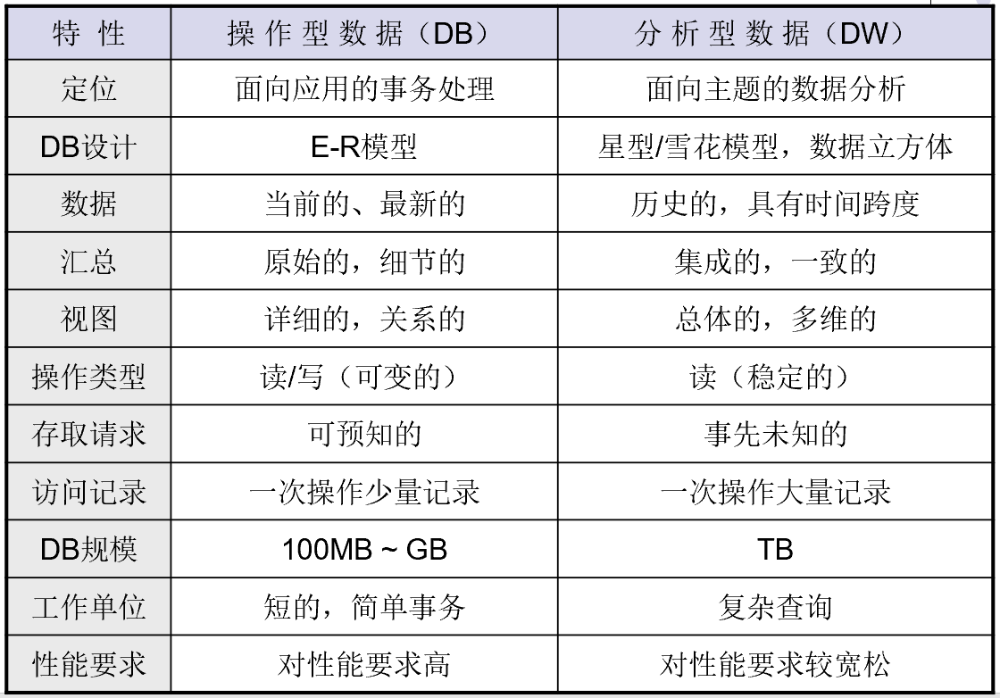

1. 定位：
   1. 操作型数据：应用是需求过程中产生的
   2. 分析型数据：主题是分析对象
2. DB设计
   1. E-R模型
   2. 星型和雪花用来解决多维数据的问题(一个来源于客观，服务于主观的主题大概率是一个多维的)，通过表和表之间的关系，用二维数据表示多维关系。
3. 操作类型
   1. 操作型数据：增删改查
   2. 分析型数据库：读(稳定的)
4. 存取请求
   1. 操作型数据：可预知的
   2. 分析型数据：事先未知的

### 1.2.4. 信息系统的发展历史


1. TPS(Transaction Processing System)：**收集、处理、存储**相关的数据。
2. MIS(Management Information System)：仅仅对数据库进行**收集和采集**是远远不够的，我们基于这些生成出统计报表，并且能够依据此进行决策。
3. EIS(Executive Information System)：**添加外部数据**，结合当前的多种统计报表
4. DSS(Decision Support System)：没有主管能够精通全部的业务，可以基于算法来进行相应的辅助，但是这部分是有问题的。
5. OLAP/DM：不要和操作型环境中的数据库进行相应操作了，转换为在数据仓库中进行相应的分析型结果。

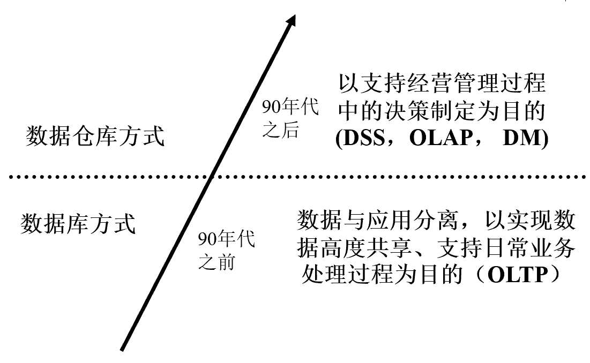

## 1.3. 决策支持系统(DSS)
1. **决策支持系统**是上世纪70年代兴起的一种计算机应用技术，用于帮助企业领导作辅助性决策。
2. 传统的**决策支持系统**由三个组成部分
   1. 数据
   2. 算法与模型
   3. 展示
3. 我们将数据库**屏蔽在外**，而是直接在模型库上进行相应的决策

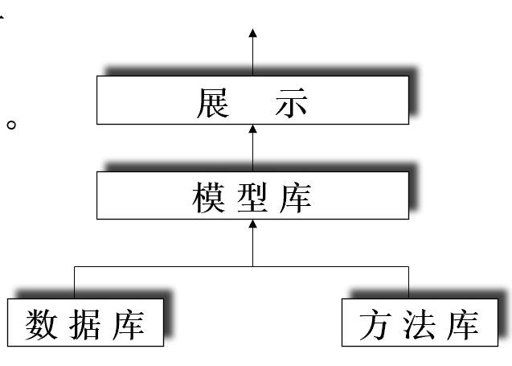

## 1.4. 事务处理环境和分析处理
1. 数据库技术一直力图使自己能够胜任从**事务处理、批处理到分析处理**的各种类型的处理任务
2. 为了进行分析型数据的处理，人们在关系数据库中放宽了对**冗余**的限制，引入了**统计及综合数据**，在事务处理环境下建立了传统的DSS。大量的数据是需要冗余的：因为我们大部分情况下没有时间也没有意义进行重复计算，所以我们引入了**统计及综合数据**。
3. 作为数据管理手段的数据库技术尽管在事务处理方面取得了巨大的成功，但它对分析处理的支持却一直不能令人满意。
   1. **统计、综合数据的应用逻辑**却是**分散杂乱**的、**非系统化**的，因此分析功能有限，不灵活，响应慢，维护困难：不同计算方式得到的结果的合并是难以复杂的。
   2. 以**业务处理**为主的OLTP和**分析处理**为主的DSS应用，在同一个数据库系统中有明显冲突。
4. 数据只为**职员**服务，不为老板服务。
   1. 只用数据，不用信息是不可能的。用散布在若干不同地方的数据构造成零散的信息片段，用零散的信息片段取代整个信息体是困难的。
   2. 无关系数据之间如何自圆其说：存在数据冲突但是不导致事务出现冲突，则可以继续向下运行

## 1.5. 事务处理环境不适宜建立DSS的原因
> 在传统的以数据库为核心的事务处理环境中不适宜建立DSS等分析型应用，其原因主要有以下六条：

1. 事务处理和分析处理的性能特性不同
2. 数据集成问题
3. 数据的动态集成问题
4. 历史数据问题
5. 数据的综合问题
6. 数据的访问问题

### 1.5.1. 原因一：事务处理和分析处理的性能特性不同
1. 事务处理
   1. 用户每次操作处理的时间短，存取数据量小，但操作频率高，并发程度大
   2. 允许多个用户按分时方式使用资源
2. 分析处理
   1. 每次分析可能需要连续运行很长的时间，存取数据量大，但很少做这样的分析处理，也没有并发执行的要求
   2. 占用大量的资源：不可能预留部分的资源
3. 如果我们强制要求在数据库上进行分析处理，那么分析处理就会和事务处理进行**资源抢占**。

### 1.5.2. 原因二：数据集成问题(主要原因)
1. **事务处理**一般只需要与本部门业务有关的当前细节数据，而对整个企业范围内的集成应用考虑很少，这就造成大部分企业内部的数据是分散而非集成的
   1. 事务处理应用的**分散性**：在**业务、逻辑和地理**上都具有分散性。
   2. "蜘蛛网"问题：
      1. 大规模操作型数据环境中，具体数据处理会细分到每一个分散的部分进行处理，并且只会考虑自己的部分，而不会考虑和其他部分**对接**
      2. 分布的数据库的**各自演化**，导致数据是**不一致**的。
      3. 不同的数据库有不同的数据源得到的数据，具有**血缘**关系。
   3. 数据不一致问题：
      1. **数据类型、单位的不一致性**：不同的变量类型比如float、int等等、日元和人民币等情况
      2. **同名异义、同义异名**现象：weight在不同场景下具有不同的含义。
      3. 因数据的**重复抽取**而带来的数据不一致性
   4. 缺少分析所需要的**外部、非结构化**数据
2. 分析处理
   1. **全面而正确**的数据是有效的分析和决策的首要前提
   2. DSS需要集成的数据，包括整个企业内部各部门的相关数据，以及**企业外部、竞争对手**等处的相关数据(这部分也应该是集成数据的一部分)
   3. 因此，用于分析处理的数据可能来自多种不同的数据源：
      1. 同构/异构数据库
      2. 文件系统
      3. Internet
      4. 外部的用户数据
3. 对于需要集成数据的DSS应用来说，在应用程序中对事务处理环境中的这些纷繁复杂的数据进行集成将带来下述问题：
   1. **大大加重程序员的负担**：需要对所有的操作型数据环境熟悉、对所有的数据库熟悉。
   2. **重复计算导致极低的分析处理效率**：如果不存储，那么下次需要再次使用还要重新计算。
4. 数据集成问题是为什么不能用数据库来进行分析型操作的主要原因。

### 1.5.3. 原因三：数据的动态集成问题
1. 静态集成：对所需数据进行一次集成，以后就不再发生变化，将增删改查开放给了程序员进行操作，不方便进行动态集成，这部分功能数据库是不提供的
2. 动态集成：**对集成后的数据进行周期性刷新**
3. 在采用静态集成策略时，如果数据源中的数据发生了变化，那么这些变化就不能反映给决策者，导致决策使用的是过时的数据。因此集成数据必须以一定的周期进行刷新(即采用动态集成策略)，但传统的事务处理环境并不具备动态集成的能力

### 1.5.4. 原因四：历史数据问题
1. 事务处理
   1. 一般只需要当前数据，在数据库中一般也只存储短期数据(3-6个月)，且不同数据的保存期限也不一样
   2. 数据库中的过时数据(即历史数据)虽然也能通过数据转储等方式保存下来，但往往被束之高阁，未能得到充分利用
2. 分析处理
   1. 更看重**历史数据**(5-10年)，可以通过对大量历史数据的详细分析来把握企业的发展趋势
   2. 历史数据对于事务处理作用不大，但对于决策分析而言，如果没有历史数据的支撑，就变成了"无源之水"、"无本之木"

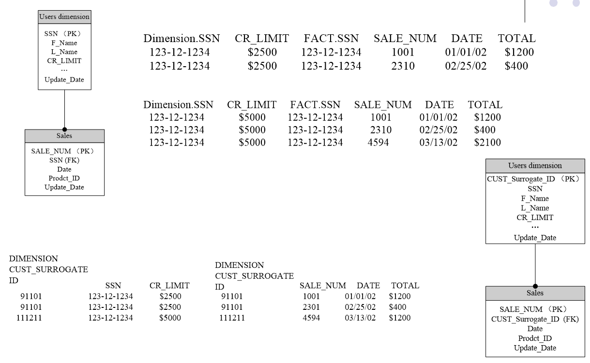

1. CR_LIMIT指信用最高额度，我们利用SSN进行连接
2. 如果交易过程中，当前用户的额度提高
3. 在数据库中，额度的变更不会出现问题。但是对于决策过程，你的额度可能会有很大的影响(比如2500和5000不一样的)
4. 解决方案:
   1. 使用另一条记录来标识修改，使用自然关键字
   2. 将SSN解耦，替换使用CUST_Surrogate_ID作为外键，用来解决额度变更后的不一致问题。
   3. 这样子SSN不是主键了

### 1.5.5. 原因五：数据综合性问题
1. **事务处理**需要的是当前的**细节性**操作数据，而**分析处理**需要的往往是大量的总结性分析型数据
   1. 事务处理系统中积累的是大量的**细节数据**，而分析处理并不对这些细节数据进行分析，其原因是：
      1. 细节数据量**太大，影响处理效率**
      2. 不利于分析人员将注意力集中于**有用**的信息上
2. 这就是常说的数据库中"**数据丰富、信息贫困**"现象
3. 因此，在分析前往往需要对细节数据进行不同程度的综合，传统的事务处理系统不具备这种综合能力，而且在数据库系统中，这种综合还往往因为是一种数据冗余而被限制

### 1.5.6. 原因六：数据的访问问题
1. 事务处理
   1. 需要提供多种不同类型的**数据访问操作**
   2. 对于需要**修改**的数据必须实时"更新"数据库
2. 分析处理
   1. 数据的访问操作以"**读**"操作为主
   2. 不需要实时的"更新"操作，但需要定时"**刷新**"

## 1.6. 综上所述
1. 在事务处理环境中直接构建分析处理应用是不合适的，要提高分析处理和决策支持的效率和有效性，必须
   1. 将**分析型处理及其所需的综合性分析数据**从传统的事务型处理和细节性操作数据中分离出来
   2. 按照分析型处理的需要重新进行组织，建立单独的分析处理环境
2. 数据仓库正是为建立这种新的**分析处理环境**而出现的一种数据存储和组织技术

## 1.7. 数据仓库出现的原因
1. 将**数据仓库与操作型数据库**分离开来，从而：
   1. 提高两个系统的**性能**
   2. 提高操作型数据库的**事务吞吐量**
   3. 两个系统中数据的结构、内容和用法的不同
2. 建立数据仓库的目的并不是要代替传统的事务处理系统/数据库，而是**为了适应因市场商业经营行为的改变和市场竞争程度的加剧而进行的分析型处理的需要**
3. 数据仓库技术正成为企业信息集成和辅助决策应用的关键技术之一

# 2. 数据仓库及其四大特征

## 2.1. 数据仓库
> W.H.Inmon 在《建立数据仓库》一书中，对数据仓库的定义为：数据仓库就是一个**面向主题的、集成的、非易失的(稳定的)、时变的(随时间不断变化的)数据集合**，用于支持经营管理过程中的决策制定

> Tim.Shelter(Informix公司负责研究与开发的副总裁)：数据仓库将分布在企业网络中不同信息岛上的商业数据集成到一起，存贮在一个单一的**集成关系型数据库**中。利用这种集成信息，可方便用户**对信息的访问**，更可使决策人员对一段时间内的历史数据进行分析，研究事物**发展走势**

> 商务智能的两大目标
> 1. 改善信息访问
> 2. 提供数据支持

## 2.2. 数据仓库的特征
1. 面向主题
2. 集成
3. 非易失(稳定的)
4. 时变的(随时间不断变化)

### 2.2.1. 面向主题
- 面向**应用**的数据组织(数据库)

```
采购子系统：
  订单(订单号，供应商号，总金额，日期)
  订单细则(订单号，商品号，类别，单价，数量)
  供应商(供应商号，供应商名，地址，电话)
销售子系统：
  顾客(顾客号，姓名，性别，年龄，文化程度，地址，电话)
  销售(员工号，顾客号，商品号，数量，单价，日期)
库存管理子系统：
  领料单(领料单号，领料人，商品号，数量，日期)
  进料单(进料单号，订单号，进料人，收料人，日期)
  库存(商品号，库房号，库存量，日期)
  库房(库房号，仓库管理员，地点，库存商品描述)
人事管理子系统：
  员工(员工号，姓名，性别，年龄，文化程度，部门号)
  部门(部门号，部门名称，部门主管，电话)
```

1. 面向应用的数据组织特点
   1. 表达数据流程：**倒因为果**
   2. 和业务中的单据或文档对应
   3. 逻辑、数据**不完全分离**：我们希望能够分离，但是这是困难的
   4. 和部门、组织相关：数据、数据库和应用与组织相关，组织优先，而不会过多参考其他部分。
2. 面向应用的数据组织基本上是按照企业内部的**业务活动**及其需要的**相关数据**来组织数据的存储的，虽然能够方便高效的支持OLTP，但没有实现真正的数据与应用分离，其抽象程度也不够高
3. 数据仓库中无法做到面向应用：**没有办法模拟出所有的决策**
  
#### 2.2.1.1. 主题(Subject)
1. **主题**是较高层次上将企业信息系统中的**数据综合、归类并进行分析利用**的抽象。在逻辑意义上，是对应企业中某一宏观分析领域涉及的**分析对象**
2. 主题可以是一个信息体，也可以是一个信息体的一个有效部分。
3. 主题是面向决策人员的**主观要求**。

```
CRM，客户关系管理
  优质客户的挖掘
  新客户的发现
ERP，企业资源计划
  销售管理
  产品质量控制
  库存管理
```

#### 2.2.1.2. 面向主题
1. **面向主题**是指数据仓库内的信息是按主题进行组织的，为按主题进行决策的过程提供信息
   1. 传统数据库中的数据是**原始、基础数据**
   2. 特定分析领域数据则是需要对它们作必要的**抽取、加工与总结**而形成
2. 数据仓库是面向分析、决策人员的主观要求的，不同的用户有不同的要求，同一个用户的要求也会随时间而经常变化，因此，**数据仓库中的主题有时会因用户主观要求的变化而变化**
3. 如果按照面向主题的方式进行数据组织，首先应该抽取主题，即按照管理人员的分析要求来确定主题，而与每个主题相关的数据又与有关的事务处理所需的数据不尽相同。
4. 在该例中，我们可以抽取出三个不同的主题(即分析对象)及其相关的数据：
   1. 商品
   2. 供应商
   3. 顾客

#### 2.2.1.3. 示例
```
主题一：商品
  商品固有信息
    商品号，商品名，类别，颜色等
  商品采购信息
    商品号，供应商号，供应价，供应日期，供应量等
  商品销售信息
    商品号，顾客号，售价，销售日期，销售量等
  商品库存信息
    商品号，库房号，库存量，日期等
主题二：供应商
  供应商固有信息
    供应商号，供应商名，地址，电话等
  供应商品信息
    供应商号，商品号，供应价，供应日期，供应量等
主题三：顾客
  顾客固有信息
    顾客号，顾客名，性别，年龄，文化程度，住址，电话等
  顾客购物信息
    顾客号，商品号，售价，购买日期，购买量等
```

1. 在每个主题中，都包含了有关该主题的**所有信息**，同时又抛弃了与分析处理**无关或不需要**的数据，从而将原本分散在各个操作性处理系统中的有关信息集中在一个主题中，形成**有关该主题的一个完整一致的描述**
2. 面向主题的数据组织方式所强调的就是要形成一个这样一致的信息集合：虽然蓝色部分是来自不同地方，但是我们要构造出**商品这个整体**。


1. 不同的主题之间也有**重叠的内容**，但这种重叠的特点是：
   1. 是**逻辑**上的，而不是物理存储上的重叠
   2. 是部分**细节**的重叠，而不是**统计信息**的重叠
   3. 可以反映不同主题之间的**直接和间**接的联系
2. 主题之间是一定有关系的，要么**直接相关**，要么**间接相关**，如果有一个主题不满足以上两种关系，那么我们需要考虑在分析过程中是否遗漏了什么：比如遗**漏了商品**


1. 每个主题所需数据的物理存储：
   1. 多维数据库(MDDB，Multi-Dimensional Database):用多维数组形式存储数据
      1. 每一个上下文就是一个维度。
      2. 在主题中应当有尽可能多的维度。
      3. 表中填写的数据是核心的数据，表头就是上下文。
   2. 关系数据库:
      1. 用一组关系来组织数据的存储，同一主题的一组关系都有一个公共的关键字
      2. 在关系中存放的不是细节性的业务数据，而是经过一定程度的综合形成的**综合性数据**
      3. 这是目前实现数据仓库中数据的物理存储的常用方法
2. 以"商品"这个主题为例，其公共码键是"商品号"，其关系存储如下：

```
1. 商品的固有信息
   1. 细节数据
      1. 商品表(商品号，商品名，类型，颜色，…)
   2. 综合数据
      1. 商品表1(商品类别，商品颜色)
      2. 商品表2(价格，商品种类)
2. 采购信息
   1. 细节数据
      1. 采购表(商品号，供应商号，供应日期，供应价，…)
   2. 综合数据：根据不同的时间段(月、季度、年)来统计商品的采购总量
      1. 采购表H1(商品号，时间段1，采购总量，…)
      2. .....
      3. 采购表Hn(商品号，时间段n，采购总量，…)
3. 销售信息
   1. 细节数据
      1. 销售表(商品号，顾客号，销售日期，售价，销售量，…)
   2. 综合数据：根据不同的时间段(日、周、月、年)统计得到的销售总量
      1. 销售表1(商品号，时间段1，销售总量，…)
      2. ......
      3. 销售表n(商品号，时间段n，销售总量，…)
4. 库存信息
   1. 细节数据
      1. 库存表(商品号，库房号，库存量，日期，…)
   2. 综合数据：根据不同的时间点抽样得到的商品库存数量
      1. 库存表1(商品号，库房号，库存量，星期，…)
      2. ......
      3. 库存表n(商品号，库房号，库存量，年份，…)
```

### 2.2.2. 集成
1. 数据仓库中的数据是为**分析**服务的，而分析需要多种广泛的**不同数据源**以便进行比较、鉴别，因此数据仓库中的数据必须从**多个数据源**中获取，这些数据源包括多种类型数据库、文件系统以及Internet网上数据等，它们通过数据集成而形成数据仓库中的数据
2. 集成的方法：从具体的数据到生成出概要性的统计后的数据。
   1. **统一**:消除不同数据源之间的**数据不一致**的现象，如字段的同名异义、异名同义、单位不统一、字长不一致……
   2. **综合**:对原有数据进行**综合和计算**，如统计、抽样……

### 2.2.3. 非易失(稳定的)
1. 数据仓库的数据与操作性数据环境隔离
2. 数据仓库中的数据是经过抽取而形成的**分析型数据**，不具有原始性，主要供企业决策分析之用，执行的主要是"查询"操作，一般情况下不执行"更新"操作。同时，一个稳定的数据环境也有利于数据分析操作和决策的制订
3. 但这也不等于数据仓库中的数据不需要"更新"操作，如：
   1. 在需要进行新的分析决策时，可能需要进行新的数据抽取("插入"操作)和"更新"操作
   2. 数据仓库中的一些过时的数据，也可以通过"删除"操作丢弃掉
4. 因此，数据仓库的存储管理相对于DBMS来说要简单得多
5. **稳定的并不等于静态的**。

### 2.2.4. 时变的(随时间不断变化)
1. 数据仓库内的信息并不只是关于企业**当时或某一时点**的信息，而是系统记录了企业从**过去某一时点到目前的各个阶段**的信息，通过这些信息可以对企业的**发展历程和未来趋势**作出定量分析和预测
2. 因此，数据仓库中的数据通常都带有**时间**属性，同时必须以一定时间段为单位进行统一更新。如：
   1. 不断增加新的数据内容
   2. 不断删去旧的数据内容
   3. 更新与时间有关的综合数据
3. 大多数的数据都和时间有关

# 3. 数据仓库的基本结构
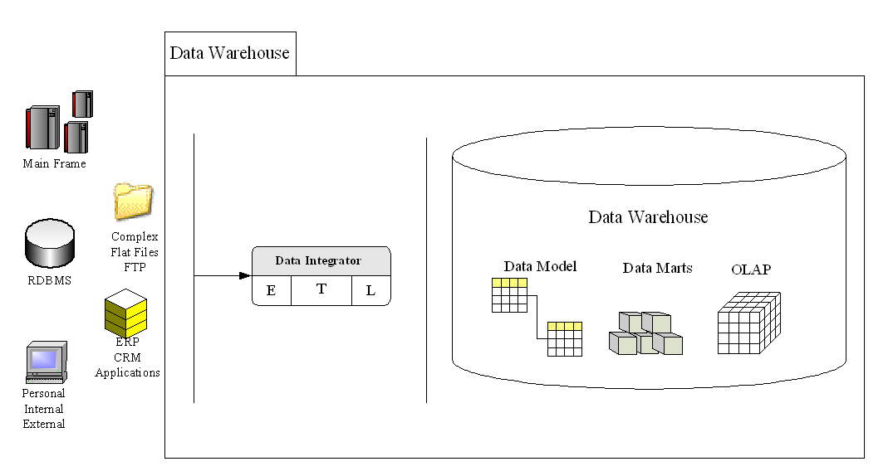

1. 两个Data Warehouse，
   1. 狭义的数据仓库不仅仅包含数据，还包含OLAP等。
   2. 广义的数据仓库应该还包括数据集成ETL
2. 还有没有画出来的Data Warehousing：也就是构建数据仓库的过程，过程如下
3. 数据仓库的数据结构从概念、逻辑、物理来设计并落地，这个过程中ETL非常重要

## 3.1. 数据仓库的关键技术
1. 数据的ETL(抽取、转换、装载)
2. 存储和管理
3. 数据的访问和表现
4. 元数据

### 3.1.1. ETL过程


1. **ETL过程**是一个约定俗称的名称，并不意味着一定按照E、T、L的方式来完成装载，我们一般使用**ELT的顺序**来完成。
2. 不应当允许对**数据仓库**进行**单独简单的修改**。
3. 比如：个人信息是多个主题的集合。在ETL中，如果我们用统一的方式管理，我们则会使用统一的时间点和方式进行更新，但是如果我们当前的数据和ETL的数据是实时更新的，会有问题，因为数据不是只读的了。
4. 开始更新后，我们会**禁止读取数据仓库**(不考虑数据仓库有热备)，如果有热备则可以从热备访问，但是一般不会这样，因为成本太高。
5. 异构数据源：
   1. **颜色不一样**表示**数据形式不一样**(数据结构、编码等)，最后形成一个数据数据，单位不是表、表单、主题。
   2. 需要耗费大量的时间来确定实体到底是不是一个**同一个实体**
6. 解析、校正、标准化、增补：
   1. **解析**：需要确定数据之间的差异，使用不同的方式进行解析。
   2. **校正**：如果有的数据是错误的，我们需要校正出来。
      1. 由于我们无法确定数据在之前进行校正的效果如何，比如学号，软院可能进行正则校正，商院可能进行数字检查，中文可能进行字符检查，但是标准是不一样的。
      2. 在业务环境中，**有些问题是不会被发现**的，也**不会造成严重影响**的。
      3. 不同的表达形式也可能是一个含义
   3. **标准化**：比如性别(整数、浮点数、布尔值、字符值)
   4. **增补**：
      1. 大量缺失数据则会无法进入主题
      2. 少量缺少数据(有相对大量数据有效)则需要我们补充回来。
         1. 一部分应用对缺失数据不敏感
         2. 另一部分则对缺失数据敏感
      3. 我们可以通过合理推理、投骰子、数据挖掘等方式来完成补充。我们需要综合考虑、谨慎选择方法，因为不同的补充算法的复杂度下不断提高

## 3.2. 数据源
1. 多数据源
   1. 数据仓库的数据来源于多个数据源。
      1. 不同**格式**的数据：由于企业在长期事务处理过程中随数据库管理系统本身发展，形成了企业内从简单到复杂、从小型到大型的各种数据库系统，其中有大型关系数据库、对象数据库、桌面数据库、各种非格式化的数据文件等。
      2. 不同的**数据操作平台**
      3. 不同的**物理位置**
2. 数据源可以是**递归**的，数据仓库的数据源可以是
   1. 另外一个数据仓库(或数据集市)
   2. 基于本数据仓库的分析型应用。
3. 数据源的抽取：相关的**数据抽取**软件
4. 常见的数据源有：
   1. 流行的关系数据库系统: Oracle, Sybase, SQL Server, DB2等
   2. 面向对象数据库系统：Objectstore等
   3. 传统的桌面数据库系统: foxbase, foxpro等
   4. 文件系统中的数据文件: UNIX, WINDOWS等
   5. 其它数据源: word, excel等

## 3.3. 数据的抽取与刷新
1. 数据抽取：数据仓库中的数据来源于**数据源**，将数据源中数据通过**网络**进行抽取，并经**加工、转换、综合**后形成数据仓库中的数据，这就是数据仓库的数据抽取。
2. 数据刷新
   1. 经过抽取进入数据仓库的数据，在经过一段时间后要重新**修正**，修改那些过时的数据，保存那些不变的数据，此种动作称为数据仓库的**数据刷新**。
   2. 数据刷新的过程与抽取类似，但刷新的数据量往往**小于**抽取的数据量。
   3. 由于仅需要对修改过的数据进行刷新，因而其实现难度与复杂性要大于数据抽取。
3. 数据抽取的重要性
   1. **数据的抽取是数据进入仓库的入口**。由于数据仓库是一个独立的数据环境，它需要通过抽取过程将数据从联机事务处理系统、外部数据源、脱机的数据存储介质中导入数据仓库。
   2. 在数据仓库层次结构中，数据抽取工作占非常重要的地位，它必须**屏蔽底层数据的结构复杂性和物理位置的复杂性**，同时还要实现对数据仓库中数据的自动刷新，要对数据仓库的元数据和数据进行维护。
4. 数据抽取的实现方法：考虑到不同数据源的数据格式和物理位置的复杂性，不同的数据源可能需要采用**不同的数据抽取**方法。

## 3.4. 转换和集成的复杂性
> 数据从操作型环境到数据仓库的传递需要完成以下功能：

1. 从操作型环境到数据仓库环境的数据抽取要实现技术上的变化。这种变化不仅指一种DBMS的变化，还可能包含源于**操作系统**的变化，硬件的变化，甚至源于基于硬件的数据结构的变化
2. 要求尽量避免从**在线窗口进行数据抽取**
3. 来自于操作型环境中的**输入关键字**在输出到数据仓库之前往往需要被重建和转换。最简单的情况下我们需要加入**时间**。
4. **非关键字数据**在从操作型环境转移到数据仓库环境时要重新格式化。例如**日期格式的转换**等，统一格式
5. 要进行**数据清理**以保持输入数据的**正确性**。数据清理常用形式有：
   1. 取值范围检查
   2. 交叉记录检验
   3. 简单的格式检验
6. 因为存在多个输入数据源，当其中的数据传入到数据仓库时要进行**合并**
7. 当存在多个输入记录时，进行记录合并之前要先进行**关键字解析**。如果不同的记录采用不同的关键字结构，那么，完成记录合并的程序必须提供**关键字解析功能**，统一完成关键字的处理。
8. 当存在多个输入记录时，这些记录的顺序可能不相同。在这种情况下需要对输入记录进行**重新排序**
9. 可能会产生多个输出结果，同一个传递过程可能会产生**不同综合层次**的结果
10. 需要提供**缺省值**。有时候数据仓库的一个输出值没有对应的数据源，这时，必须提供缺省值
11. 为抽取过程选择输入的数据时，其效率通常是一个问题。例如：如果无法将需要抽取的操作型数据和不需要抽取的操作型数据区别开来，就必须读取整个记录，从而**导致在线环境一直处于忙碌状态**，进而挤掉其它的处理活动
12. 经常需要进行**数据的汇总**。多个操作型记录被合成单个简单的记录，那些需要汇总的详细的输入记录必须进行**正确的排序**。当把不同类型的记录汇总为一个数据仓库记录时，必须对这些不同输入记录类型的到达次序进行协调，以便产生一个单一记录
13. 在数据元素从操作型环境转移到数据仓库的过程中，**应该对数据元素的重命名操作进行跟踪**，并且以文档等一定方式存储。
14. 需要读取的输入记录常常具有**不常见的或非标准**的格式，在进入数据仓库时必须要对它们进行转换。必须**指定转换逻辑，转换机制**(转换前后看上去应该是什么样子)
15. 必须理解并弄清楚建立在操作性应用程序逻辑中的数据之间的**关系**，这样这些数据记录才可以用来作为输入。而这些关系常常是深奥难懂的，并且没有可供参考的文档资料。但是当数据转移到数据仓库时，必须弄清楚这些关系。
16. 必须要进行**数据编码**的转换，如EBCDIC到ASCII的转换(或反过来)。
17. 数据仓库的设计必须符合**企业的数据模型**。
18. 当数据从操作型环境(反映当前)转移到数据仓库(反映历史)中，可能需要加入**时间**元素。
19. 数据仓库着眼于**企业信息化**，操作型数据环境着眼于**事务**。
20. 必须考虑将要进入数据仓库的**新创建记录的输出问题**。

## 3.5. ETL工具
1. 抽取/转换/装载工具(ETL)的出现，通常分为两类：
   1. **产生源代码的软件**：能力强大，但是比较烦
   2. 产生**参数化**的运行时**模块**的软件
2. 产生源代码的软件比运行时软件要强大，它可以以原有数据的格式对它们进行访问
3. 而运行时软件则需要首先对原有数据格式进行**统一**。进行了统一之后，运行时模块就可以访问原有数据。不幸的是，对原有数据格式进行统一的过程颇费心思
4. 在两种情况下，ETL软件都可以使得转换、重新格式化、从多个传统操作型数据源中集成数据的过程自动进行

## 3.6. 数据目标
1. 原子层(Atomic layer)和集成数据：本来我们应该用原子层数据来计算生成集成数据，
2. 数据集市(Data market) 
3. 操作数据存储(Operational Data Storage, ODS)
4. 缓冲区(Staging area)

> 原子层和集成数据以及数据集市，将作为数据仓库的主要数据存储，在以后的环节中进行介绍

## 3.7. 操作数据存储
1. 操作数据存储在企业范围内，针对特定主题区域，用于支持战术决策支持(tactics decision-making)的综合数据的更新集合
2. 具有以下特点
   1. 面向特定分析应用：必须要有一个主题。
   2. 完整性
   3. 当前有效
   4. 可变的
   5. 详尽的

## 3.8. DB-ODS-DW


1. 数据仓库中存放了大量的主题，并且是一定的时效性的，但是不是强实时的。
2. 我们添加ODS，只包含**几个**主题，包含了我们在某些分析过程中需要的分析数据，是针对数据仓库的增量。
3. ODS完成一个小规模的几个主题的**实时更新**，更新频率倾向于数据库。
4. ODS完全和DW中的主题都应该是对应一致的。

## 3.9. 缓冲区
1. 数据流的中间站
2. 白板式(White-board)，无特定结构
3. 系统中可能存在多处缓冲区

## 3.10. 数据刷新
1. 数据仓库系统必须能够感知到在**OLTP数据库中数据的变化情况**，并**及时**(不是实时)有效地把这些变化反映到数据仓库中去，以使得数据仓库中的数据能真实地反映实际情况，因此必须对数据仓库进行数据刷新。
2. 一般数据刷新的方法包括：
   1. 时间戳
   2. DELTA文件
   3. 建立映象文件
   4. 日志文件
3. 在一个数据仓库系统中，可以同时采用上述的四种数据刷新方式，以满足不同数据源的数据刷新需要。

### 3.10.1. 时间戳
1. 适用情况：若数据库中的记录**有时间**属性，则可根据OLTP数据库中的数据有无更新，以及在执行更新操作时数据的修改时间标志来实现数据仓库中数据的动态刷新。
2. 缺点：
   1. 大多数数据库系统中的数据并不含有时间属性。
   2. **时间不敏感的事情则不会产生时间戳**

### 3.10.2. DELTA文件
1. 适用情况：有些基于OLTP数据库的操作型应用程序在工作过程中会形成一些DELTA文件以记录该应用所作的**数据修改操作**，可根据该DELTA文件进行数据刷新。
2. DELTA文件是对数据库操作进行备份，可以查看是哪方操作导致问题(比如数据库崩溃)，一般是**底层数据库不太稳定**我们会使用。
3. 优点：采用此方法可避免对整个数据库的对比扫描，具有较高的刷新效率。
4. 缺点：这样的应用程序并不普遍，修改现有的应用程序的工作量又太大。

### 3.10.3. 建立映象文件
1. 实现方法
   1. 在**上一次数据刷新后**对数据库作一次快照
   2. 在**本次刷新之前**再对数据库作一次快照
   3. 比较两个快照的不同，从而确定数据仓库的数据刷新操作
2. 优点：对于数据库和操作型应用**无**特别要求
3. 缺点
   1. 需要占用**大量**的系统资源
   2. 可能较大地影响原有数据库系统的**性能**
4. 如果用不了其他三种，意味着**目前的数据存储技术很落后**，意味着我根本不关心性能，那么就也无所谓了。

### 3.10.4. 日志文件
1. 实现方法：一般来说，现代OLTP数据库都有日志文件，可根据OLTP数据库的日志信息来实现数据仓库的数据刷新。
2. 如果追求极端的性能，则不必记录日志，问题是如果用的不是数据库系统会出现问题。
3. 优点
   1. 日志是OLTP数据库的固有机制
   2. 不会影响原有OLTP数据库的性能
   3. 具有比**DELTA文件**和**建立映象文件**更高的刷新效率
4. 缺点：无法应用于**无日志文件**机制的遗留数据库系统等

## 3.11. 数据周期
1. 所谓数据周期是指从操作型环境中的**数据发生变化期**，到这个变化反映到数据仓库中所用到的时间。
2. 通常，数据周期应该**不低于24个小时**，因为：
   1. 操作型环境与数据仓库环境结合得越紧密，那么所需技术也就**越昂贵越复杂**。
   2. 一个更有说服力的原因是：时间间隔给环境附加了一个特殊的**限制**。间隔24小时，使得不必要在数据仓库环境中做操作性处理，也不必在操作型环境做数据仓库处理，间隔如果太短了可能会达不到这种效果。
   3. 时间间隔的一个好处是能够保证在转入到数据仓库之前，数据可以达到**稳定**。数据在进入数据仓库之前进行调整十分简单。而如果数据被送到数据仓库中之后，一旦发现必须对这些数据进行调整，就必须在操作型环境和数据仓库中同时调整。
3. 我们可能对不同的数据周期使用不同的数据周期

## 3.12. 数据仓库中的数据及数据管理
1. 数据仓库中的**数据**：数据仓库为企业管理人员的分析、决策操作提供**统一、集成**的基础数据，包括：
   1. 企业内部各个部门当前及其历史上的**细节性业务数据**
   2. 以及为了进行分析决策操作而生成的**分析型数据**
2. 对数据仓库中**数据的管理**：数据仓库中的数据是一个**统一、集成、单一**的庞大数据集合，需要借助成熟的数据库技术对其进行存储管理，即利用改造过的关系数据库系统来组织和管理数据仓库中的数据。

## 3.13. 原子层
1. 数据仓库的基础, 上层分析型应用的数据来源，所有战略分析型数据的基础。
2. 具有以下特点
   1. 原子层保持**历史集成性**
   2. 原子层拥有数据仓库的**最低细节(粒度)数据**
   3. 原子层的构建是**迭代**的
   4. 原子层的数据结构是**面向企业**的
   5. 原子层可以是**集成**的
   6. 原子层是**静态**的
3. 数据库设计没有对错，只有好坏。

## 3.14. 历史完整性
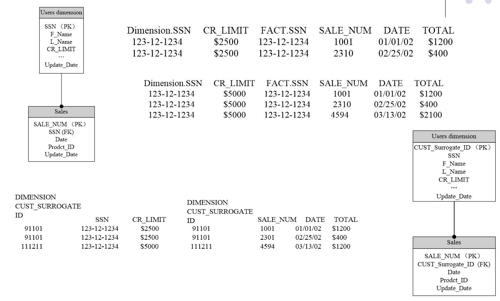

关键字问题：自然关键字与代理关键字等等。

## 3.15. 粒度
1. 对数据仓库中的数据的综合程度的一个度量
   1. 既影响数据仓库中**数据量的多少**
   2. 也影响**数据仓库能够回答询问的种类**


2. **样本数据库**：从数据仓库中取得的真实档案数据或轻度综合数据的一个子集，往往是仓库中的一部分数据**子集**，具有**周期性刷新**的特点。
3. 统计汇总后的数据可能不能用于一般的分析目的，比如张三是不是我的顾客？而只能用于分析统计：在顾客中，多少是具有大学学历的未婚男性？
4. 样本数据库粒度级别根据**采样率的高低**来划分
5. 采样粒度不同的数据库可能具有相同综合级别
   1. 按照1/100对客户记录进行抽样
   2. 按照1/1000对客户进行抽样
   3. 按照1/10000对客户进行抽样
   4. 等等

```
采购表(商品号，供应商号，供应日期，供应价，…)
   采购表H1(商品号，时间段1，采购总量，…)
   ……
   采购表Hn(商品号，时间段n，采购总量，…)
销售表(商品号，顾客号，销售日期，售价，销售量，…)
   销售表1(商品号，时间段1，销售总量，…)
   ……
   销售表n(商品号，时间段n，销售总量，…)
库存表(商品号，库房号，库存量，日期，…)
   库存表1(商品号，库房号，库存量，星期，…)
   ……
   库存表n(商品号，库房号，库存量，年份，…)
```

## 3.16. 多重粒度
| 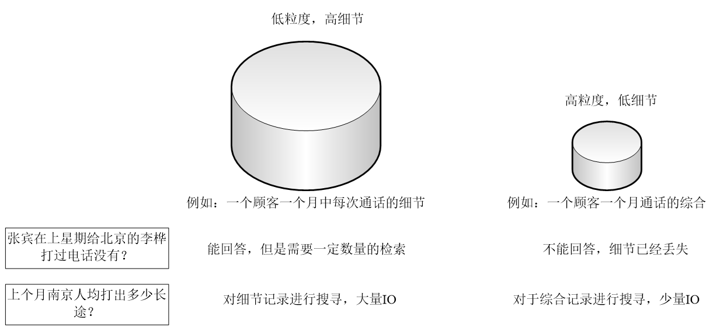 | 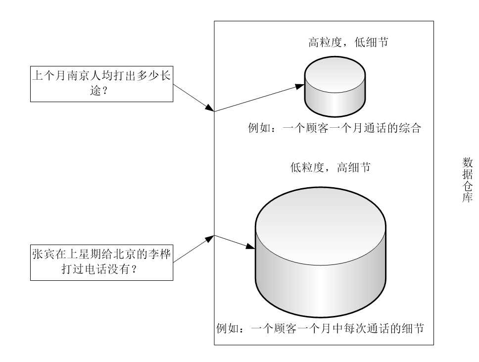 |
| -------------------- | -------------------- |

1. 对于上面的左图，如果这样子设计的话，高粒度，低细节的数据无法应对过于细节的问题，
2. 对于上面的右图，如果这样子设计的话，无论是高粒度还会低粒度的数据都可以应对。
3. 用原子层聚合得到的是聚合层/分析层。
4. 应对不同级别的粒度要求
   1. 大粒度数据，使用快速存储设备，支持大量数据访问以提高性能。
   2. 小粒度数据：使用低速存储设备，使用频率不会太高，满足细节查询。

## 3.17. 多维度，多层次
1. 数据仓库是**多维度、多层次**的
   1. **维度**是观察数据对象的**角度**：需要注意重要的维度，数据的维度
   2. **层次**是数据对象的**综合程度**：远近程度等部分
2. 维度和层次式紧密相关的。

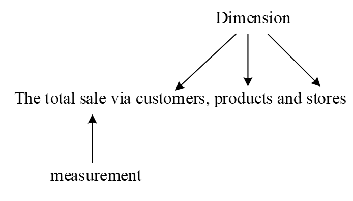

## 3.18. 数据仓库的数据组织形式
1. 简单堆积文件
2. 轮转综合文件
3. 简化直接文件
4. 连续文件

<a href = "https://blog.csdn.net/shulianghan/article/details/107851272">【DBMS 数据库管理系统】数据仓库 数据组织 ( 数据组织级别 | 元数据 | 粒度 | 分割 | 数据组织形式 )</a>

### 3.18.1. 简单堆积文件


1. 概念：将数据库中提取加工的数据，直接积累存储;
2. 操作：来一个存放一个，按照时间先后顺序存放，堆积;

### 3.18.2. 轮转综合文件
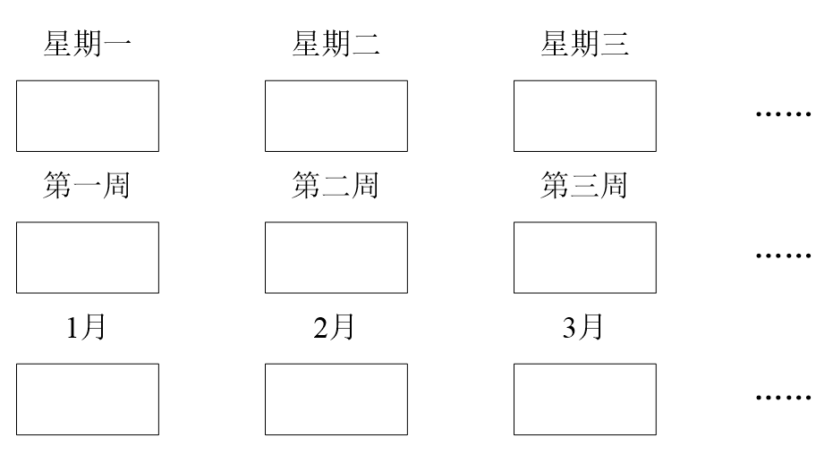

1. 概念：将数据的存储单位，分成若干级别，每个级别有有限个指定的数据;
2. 数据形式：一定时间段的综合数据，称为轮转记录;
3. 优点：结构简单，数据量比"简单堆积文件"少；
4. 缺点：综合数据，会损失数据细节，越久远的历史数据，数据细节损失的越多；
5. 操作：够一个时间段，就将指定长度的数据综合在一起； 每次综合都会损失一的数据细节;
6. 示例：如果数据积累够 1 天，直接综合成一天的数据;如果数据积累够 30 天，直接综合成一个月的数据;如果数据积累够12个月，直接综合成一年的数据，小时的数据不超过24个，天的数据不超过30个，月的数据不超过12个；

### 3.18.3. 简化直接文件
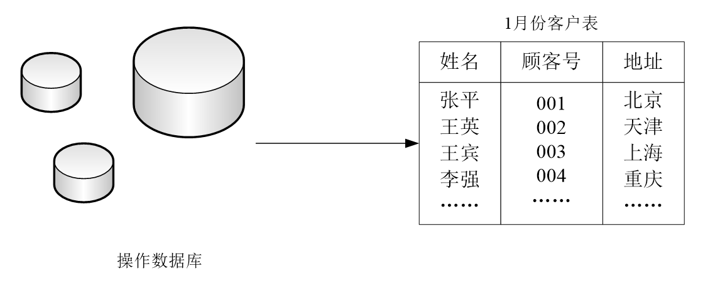

1. 概念：按照一定时间间隔，对数据库采样；
2. 快照：每隔一定时间，做一个数据库快照，存储该快照，与"简单堆积文件"类似；
3. 示例：周一对数据做一个快照，周二在做一个快照，每天都做一个数据库快照，存储下来；
4. 缺点：浪费存储空间；

### 3.18.4. 连续文件
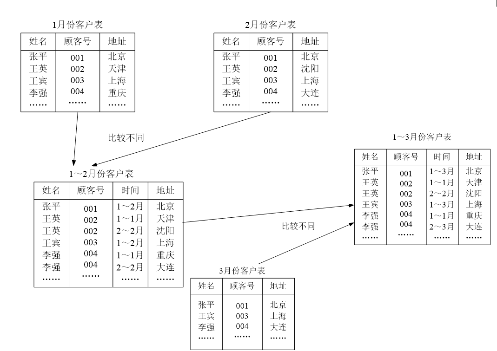

1. 在上述"简化直接文件"快照的基础之上，进行增量更新，只更新对比后的差异数据；
2. 概念：两个连续简化的直接文件，对比两个文件的差异，生成连续文件；
3. 连续文件 + 新的简单文件 = 新的连续文件

## 3.19. 数据仓库中的快照
1. 数据仓库内部以一种称之为**快照**的数据结构为中心来组织。数据仓库中的数据记录是某一时刻生成的快照，包含多种数据类型，通常包括：
   1. **关键字**，标志快照的关键字
   2. **时间**，标志事件发生的时间单元
   3. **非关键字的主要数据**，与关键字相关连的主要非关键字数据
   4. **二级数据**，在形成快照时偶然捕获并被置入快照中的数据
2. 当**数据量不是太大**，**数据稳定**，并且需要详细记录历史时，通过存储已发生的每次活动的**详细情况**，数据仓库可以跟踪每一件业务事件。否则，需要存放**集成数据**
3. 快照的生成由一些**离散活动的发生**而触发，或由**规律性的时间推移**而触发
   1. 引发快照的业务事件可能是一个**重要活动**的发生
      1. 例如，填写支票、打电话、收到货物等
      2. 在离散活动的情况下，一般是出现了一些业务活动需要记录下来
      3. 离散活动是随机发生的
   2. 一种快照触发器是**时间**
      1. 例如一天的结束、一周的结束、一个月的结束
      2. 与时间相关的快照的建立是有规律的并且是可以预知的
4. 一些例子
   1. 每当一个顾客搬迁(地址发生改变)时，数据仓库就会相应改变，而且一个连续的顾客历史记录就会写入数据仓库
   2. 假设保险金按每半年支付一次，那么每隔六个月，就会在数据仓库中创建一个快照记录，用来描述保险金的支付情况，包括支付时间、支付金额
5. 快照由四个基本的组成部分：
   1. **关键字可以唯一也可以是不唯一的**：通常是复合关键字，用来识别记录和主要数据
   2. **时间单元通常是指快照所描述事情发生的时刻**：有时时间单元指的是**捕获数据**的时刻(在有些情况下，会对事情发生的时刻和捕获时间信息的时刻加以区别，而在有些情况下则不对它们进行区别)。在由时间推移触发事件的情况下，时间元素可以**暗含**于而不是直接附于快照中。
   3. **主要数据是与记录的关键字直接相关的非关键字数据**。例如，假设关键字标识产品的销售，时间元素描述的是销售活动终结的时刻，主要数据描述的是**销售什么产品以及销售的价格、条件、地点和代理**等。
   4. 作为快照一部分而被捕获的，但与主要数据和关键字都无直接关系的**二级数据**(可选)。二级数据表示快照记录创建时捕获的外来信息。如与销售相关的二级数据是关于被售产品的一些附带信息。将来可能会在DSS处理过程中使用到的任何附带信息都可以加入到数据仓库记录中去

## 3.20. 元数据
1. 关于数据的数据，描述了数据的**结构、内容、编码、索引**等内容
2. **通过元数据可以将数据仓库和复杂的数据源系统的变化隔离，是数据仓库开发和维护的一个关键因素，也是保证数据抽取质量的依据**，应该想办法用自然语言描述
3. 种类
   1. 关于**数据源**的元数据
   2. 关于**数据模型**的元数据
   3. 关于**数据仓库映射**的元数据
   4. 关于**数据仓库使用**的元数据
4. 元数据是数据仓库的一个重要组成部分，处于数据仓库的上层，并且记录数据仓库中对象的位置。一般，元数据存储记录了以下内容：
   1. 数据仓库程序员所知道的数据结构。
   2. DSS分析员所知道的数据结构。
   3. 数据仓库的源数据。
   4. 数据进入数据仓库时发生的转换。
   5. 数据模型。
   6. 数据模型和数据仓库的关系。
   7. 抽取数据的历史记录。

### 3.20.1. 关于数据源的元数据
> 它是现有的业务系统的**数据源**的描述信息。这类元数据是对不同平台上的数据源的物理结构和含义的描述。具体为：

1. 数据源中所有**物理数据结构**：数据结构大小
2. 所有数据项的**业务定义**：哪些一样？哪些不一样？
3. 每个数据项**更新的频率**：数据项变化速度相关
4. 每个数据项的**有效值**
5. 其它系统中**具有相同业务含义**的数据项的**清单**

### 3.20.2. 关于数据模型的元数据
1. 描述了数据仓库中**有什么数据以及数据之间**的关系。它们是用户使用、管理数据仓库的基础
2. 可以支持用户从数据仓库中获取数据

### 3.20.3. 与数据仓库映射相关的元数据
1. 由数据源中的数据到数据仓库中的数据的转换过程，是需要按照一定的**规则**来进行的，这种规则往往是用一定的表达式或算法形式表示，它们是数据仓库系统的元数据的重要组成部分。
2. 这类元数据用于支持数据的抽取和访问操作。记录的信息包括：
   1. **数据源系统**：数据存取的规范、数据库文档、信息描述、安全性、数据所有者权限等；
   2. **数据处理过程**：数据的抽取、加载、清洗、过滤、协调及完成处理所需遵守的规则；
   3. **数据的刷新**：数据刷新方式、刷新频率等信息，刷新情况结果也是重要的。
3. ETL是通过**元数据**完成的 

### 3.20.4. 关于数据仓库使用的元数据
1. 这类元数据是数据仓库中信息使用情况的描述
2. 数据仓库的用户最关心两类元数据：
   1. 元数据告诉数据仓库中**有什么数据**，它们是从**哪儿**来的，即如何按**主题**查看数据仓库的内容；
   2. 元数据提供已有的可重复利用的查询语言信息。
3. 关于数据仓库使用的元数据能帮助用户到数据仓库查询所需要的信息，用以解决企业问题

### 3.20.5. 元数据的作用


### 3.20.6. 元数据管理
1. 元数据类似于数据库管理系统中的**数据字典**，主要用于数据的抽取与刷新操作，是数据抽取与刷新的基本依据。
2. **元数据一般存放于数据仓库中并受元数据管理系统的管理**，这被称为**元数据管理**。

## 3.21. 存储与管理
1. 数据仓库的组织管理方式决定了它有别于传统数据库的特性，同时也决定了其对外的数据表现形式。
   1. 数据量很大
   2. 并行处理
   3. 针对决策支持查询的优化
   4. 支持多维分析的查询模式

## 3.22. 数据仓库管理系统
1. 数据仓库管理系统用于**管理、统计分析型数据**，其管理方法与传统关系数据库管理系统类似，因此一般采用传统的关系数据库管理系统或其变种来进行数据仓库管理。
2. 如可用Oracle，Sybase，SQL Server等作适当改进即可成为数据仓库管理系统。
3. 在一个数据仓库中集成了整个企业内部所有部门的数据信息，几乎90%以上的数据仓库系统中的数据量都达到了GB，甚至TB级，因此也需要有效的数据仓库管理技术，包括对数据的**安全、归档、备份、维护、恢复**等工作，这些工作就要利用数据库管理系统(DBMS)的功能来实现。

## 3.23. 数据仓库建模
1. 数据仓库建模：**建立数据仓库的模式**。
2. 数据仓库的模式结构：如同数据库的模式设计一样，我们也需要设计建立数据仓库的数据模式。如果采用**关系数据库系统**作为数据仓库管理的工具，则数据仓库的模式结构在形式上与关系模式一样。
3. 数据仓库的建模过程：但数据仓库的建模方式有别于传统的数据库建模(即关系模式设计)，因此需要有**独立的数据仓库建模工具**作为数据仓库管理工具的一部分。数据仓库建模的具体构作过程可参见数据仓库设计。

## 3.24. 数据的展现
多通过第三方的工具软件来完成

# 4. 数据集市与数据仓库
> 数据仓库发展和OLAP紧密相关，数据仓库会为OLAP提供服务。

## 4.1. 建立数据集市的原因
1. 在网络环境中，即使存在多个可用的数据源，但最终用户可能仍然得不到什么可用的信息
2. 早期的数据仓库概念仅仅提供一个多数据源的数据集成功能，为最终用户访问多个数据源提供统一的数据视图和访问接口
3. 作为一种反映主题的**全局性数据组织**，数据仓库提供
   1. 统一的数据模式
   2. 统一的数据表示
   3. 统一的数据属性
4. 而**全局性数据仓库往往太大**，在实际应用中将它们按部门或个人分别建立反映各个子主题与区域的局部性数据组织，它们即是**数据集市**。因此，有时我们也称它为**部门数据仓库**，数据仓库可以理解成主题的集合。
5. 例如在有关商品销售的数据仓库中可以建立多个不同主题的数据集市：不同的主题会应用到的数据不同，对**数据的时效性**等部分要求不同。
   1. 商品采购数据集市
   2. 库房使用数据集市
   3. 商品销售数据集市
6. 操作型数据库 vs. 数据集市
7. 应当尽量避免人们对其中的数据的**误解**，用更明显的方式展示出来。
8. 仅仅有数据仓库会导致数据仓库的资源的**访问率**比较高，同时对于每一个访问数据仓库的人其**访问理解、选择和使用主题的成本**比较高。
9. **总而言之**：
   1. 数据仓库太大
   2. 找起来不方便
   3. 效率比较低

## 4.2. 数据仓库/数据集市体系
1. 一个完整的数据仓库/数据集市体系结构一般由**三个层次**组成,它们是：
   1. 数据源
   2. 数据仓库
   3. 数据集市(Data Mart)：并不是必要的，根据需要情况来确定是否需要有。
2. 三者之间通过数据仓库管理软件联系起来构成一个**完整的数据体系**
3. 绝大多数情况下，我们是用不到数据仓库中的**全部信息**的，而只是需要局部的。
4. 范围越小的应用，其**访问频率**越高，其访问时长就应该越短，就应该在逻辑上更加紧凑，这也就促进了数据集市的出现和产生。

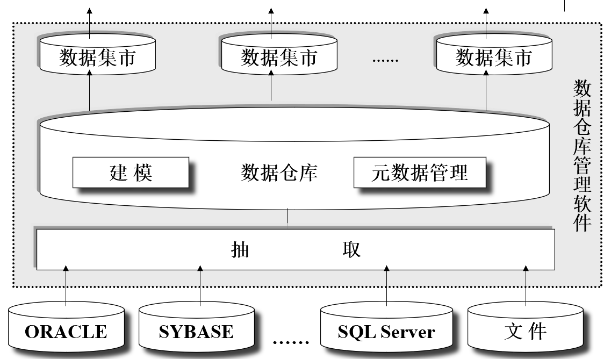

## 4.3. 数据集市
1. 数据仓库与数据集市的关系类似于传统关系数据库系统中的**基表**与**视图**的关系
2. 数据集市的数据来自数据仓库，它是数据仓库中数据的一个**部分与局部**，是一个数据的**再抽取与组织**的过程
3. 数据集市是数据仓库的一个**子集**，会和一个或一类**应用**相关联。
4. 建立数据仓库与数据集市的过程可以有两条途径，实际上反映了一个完整的**企业级数据仓库**的建立过程：
   1. 从全局数据仓库到数据集市
   2. 从数据集市到全局数据仓库
5. 数据集市的数据来源于数据仓库，专门用以满足**特定商务单元、商务程序、或商务应用**的需求
6. 具有以下特点
   1. 面向主题：我们只面向部分的主题，而一般并不会使用全部的主题
   2. **存储**了预聚集数据：将某些常用的数据进行了预聚集处理。
   3. 特定分析需求或用户群快速获取信息
   4. 体现终端用户的观点，面向数据仓库的界面
   5. **多层次、多维度**
7. 不需要保证**数据集市和数据仓库**在数据结构上的一致性。
8. 在数据仓库中，我们使用元数据规定数据形式，所以我们完全是可以溯源的。

| 独立型数据集市       | 从属性数据集市       |
| -------------------- | -------------------- |
| 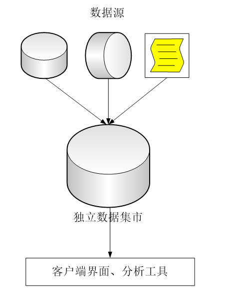 | 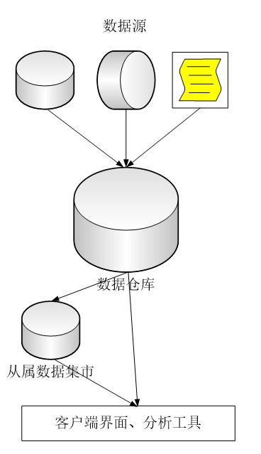 |

1. 独立性数据集市：所有的特征和数据仓库是一样的，也是面向主题的，满足四大特征，构建过程也没有区别，区别只是被局限到比较小的一个范围中，这个数据集市是独立于数据仓库的，和构架一个独立的数据仓库没有区别，类似于构建小的数据库。
2. 从属性数据集市：有选择的前提下，我们认为从属性数据集市要优于独立性，因为我们是从全局先分析，然后进行选择的。

## 4.4. 数据仓库与数据集市的关系
1. 自顶向下的结构：从属性数据集市
2. 自底向上的结构
3. 总线结构的数据集市
4. 企业级数据集市结构

### 4.4.1. 自顶向下的结构
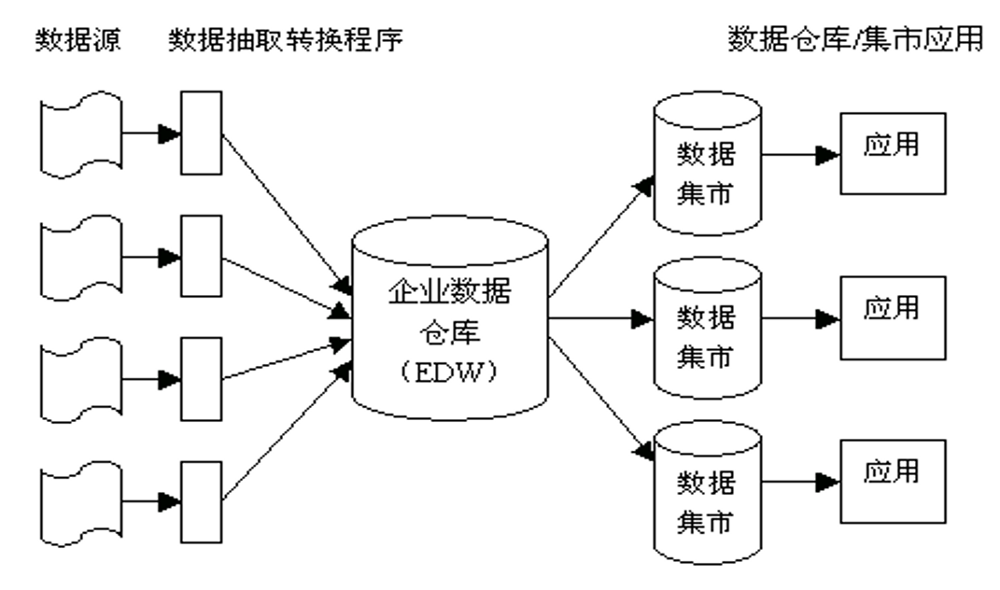

首先从从属数据源收集数据，不同数据集市之间的交集是否为空是不确定的，根据具体情况而定。

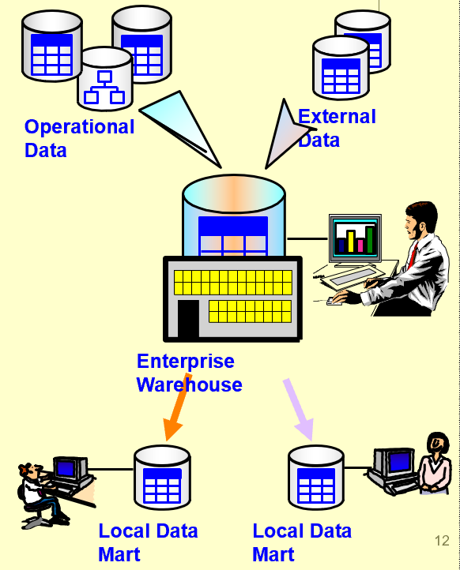

1. 构建企业数据仓库：需要时间完成调研和数据收集。
   1. 公共中央数据模型
   2. 数据再加工
   3. 减少冗余和不一致性
   4. 搜集历史的、细节的、全局的数据：数据仓库中的任何数据可以以任何方式聚合成数据集市中的聚合数据。
2. 基于**企业数据**仓库构建数据集市
   1. 选定企业模型下的部门主题
   2. 聚集数据
   3. 建立集市数据对企业数据仓库的依赖关系
3. 优点
   1. 建立数据集市能够减轻DW访问负载
   2. 各部门可以任意处理数据
   3. 数据转换和整合在DW阶段统一完成
   4. 具备数据缓冲功能：数据仓库有数据缓冲的作用
4. 缺点：
   1. **成本高**
   2. **见效慢**：短期之内看不到效果
   3. 数据集市间不共享资源：可能导致**不一致性**等困难，数据集市具有一定的**局部性**。

### 4.4.2. 自底向上的结构
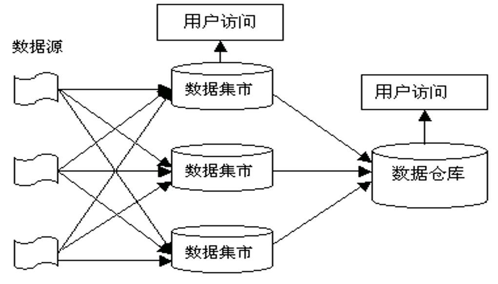

由各个部门分别构建数据集市，最后汇总成为数据仓库是比较困难的，因为数据集市的数据格式并不规整(元数据并不相似)，最后综合考虑成本，选择重新构建数据仓库，而放弃已有的数据集市。

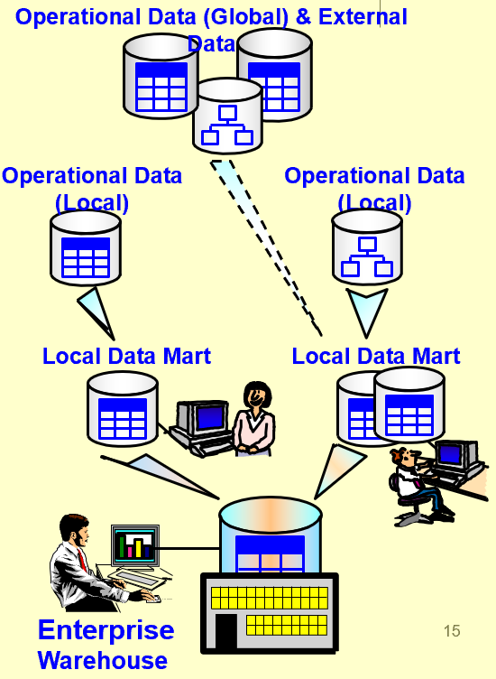

1. 构建数据集市
   1. 划定主题区域
   2. 快速实施，本地自治
   3. 易于复制
   4. 数据再加工
   5. 允许一定的冗余和不一致
2. 基于数据集市构建企业数据仓库
   1. 确定各数据集市的可用性
   2. 模型的合并
   3. 消除不同数据集市之间的数据不一致性
3. 优点:**见效快、启动资金少**
4. 缺点
   1. 各个部门都要进行数据清理整合
   2. 可能造成"蜘蛛网"、数据不一致等问题
   3. 总体上没有节约资金

### 4.4.3. 总线结构的数据集市
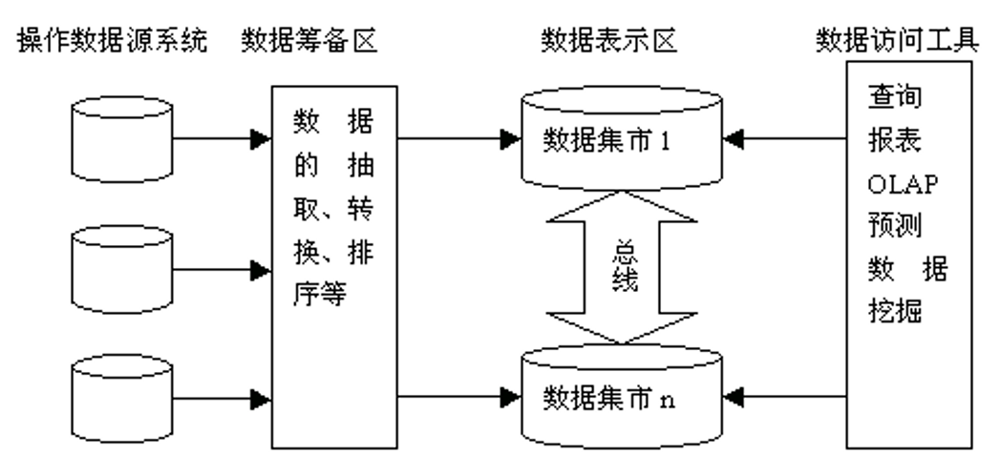

之前的独立的数据集市等价于独立的数据源，制作数据仓库比较麻烦，所以我们使用数据筹备区，每一个数据格式遵循规则。


> 1. 订单、商品库存和商店的销售都是主题，都包含上下文信息(有效的上下文)，都包含了分析订单等相关的核心数据的重要信息。
> 2. 基于统一标准的**数据集市**。
> 3. 总线是大家共用的，一开始使用标准将所有的数据集市定义完毕，我们根据总线来查找所有数据，用来替代全局的数据仓库。
> 4. 对于原来的一个主题，分布在不同的数据仓库中，共享部分的数据结构未必完全一致，数据内容也未必完全一致，比如不同数据库存储的身高信息。
> 5. 各部门资源的使用和全局资源的使用的。

1. 特点
   1. **不建立数据仓库而直接建立数据集市**
   2. 各个数据集市不是孤立的，相互之间通过一种共享维表和事实表的"**总线结构**"紧密联系在一起：比如突然又多了个一个数据集市叫做员工，然后修正受到影响的主题和数据集市
2. 优点：**共享维表和事实表**，解决了建立数据集市的许多问题
3. 缺点：
   1. 这种结构基于**多维模型**，应用限制于**OLAP**
   2. **多个数据源直接影响多个集市**，造成数据仓库结构不十分稳定

### 4.4.4. 企业级数据集市结构
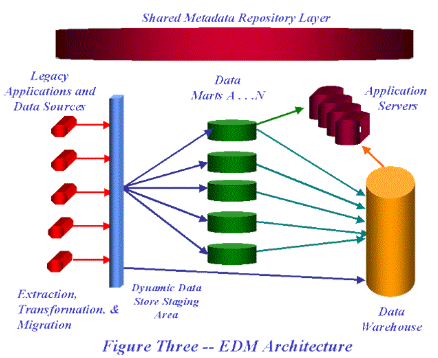

1. 首先通过数据源构建**企业级**的数据模型。
2. 然后构建出总线：规定了数据集市和数据集市之间的公共数据结构
3. 每一个数据集市做ETL，得到目前迫切需要使用的数据集市，数据瑕疵需要完成对齐。
4. 数据仓库中会包含**数据集市中不包含的主题**。
5. 需要构造新的数据集市，则可以直接用数据仓库进行转化。

# 5. 数据仓库的应用
1. 在数据库及数据仓库中存贮有大量的数据，它们具有规范的结构形式与可靠的来源，且**数量大、保存期间长**，是一种极为**宝贵**的数据资源。
2. 充分开发、利用这些数据资源是目前计算机界的一项重要工作
3. 数据资源的利用有**三种方式**：从DB、OLTP到DW、DSS
   1. 数据资源的**查询**服务：并不是完全的信息访问
   2. 数据资源的**演绎**：和数据查询是不完全一样的，当前查询的数据并不是保有在我们的数据库中的，在不同维度上，用不同上下文提取。
      1. 演绎数据库，**知识库**
      2. **统计分析软件**(SAS，SPSS)
   3. 数据资源的**归纳**：数据挖掘，找到一般性规律(数据规律)

## 5.1. 操作型、分析型环境间的数据流
1. 某些时候，存在从数据仓库环境到操作型环境的**数据回流**。
2. 操作型环境中采用SQL等方式，直接访问数据仓库的"回流"是不正常的。
3. 绝大多数情况下，都是从数据源向数据仓库流动的。

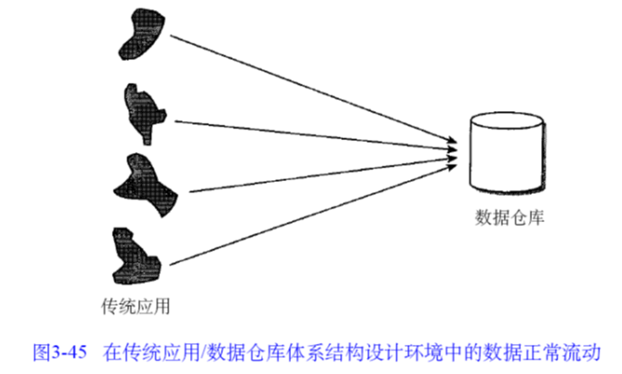

## 5.2. 数据仓库数据的直接访问
1. 由操作型环境到数据仓库数据的**直接访问**有以下限制：
   1. 从响应时间的角度来考虑，请求**数据仓库数据的操作型**处理通常不具有**在线特性**：不可能购买一辆车报价需要1个小时，我们只能选择使用部分数据
   2. 对数据的请求必须是最小量的
   3. 管理数据仓库所用到的技术(如协议等)必须与管理操作型环境所用到的技术一致
   4. 从数据仓库取得的、准备传输到操作型环境的数据**必须不做或很少的格式化**
2. 因此，由操作型环境到数据仓库数据的直接访问很少

## 5.3. 数据仓库数据的间接访问

### 5.3.1. 航空公司的佣金计算系统
1. 考虑旅行社代表客户与航空公司进行订票服务，航空公司需进行一个最佳佣金的计算。
2. 最佳佣金的计算需要考虑当前的**预定情况和历史情况**
3. 当前的预定情况提供了目前飞机票的预定情况，而历史情况则提供了过去一段时间的订票情况。基于二者可以计算出一个最佳的佣金
4. 考虑到实际情况，航空公司采用离线方式完成佣金计算和航班历史分析，离线计算和分析以周期性的方式进行，并创建一个小的易于访问的航班状态表。这样，当航空公司与旅行社交互时，很容易查阅当前订票情况和航班状态表

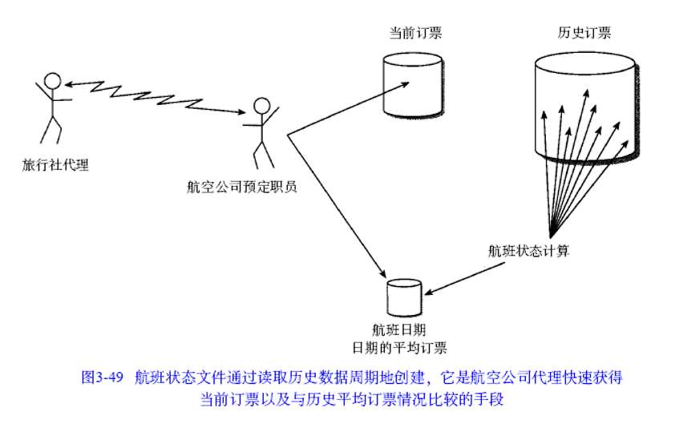

> 在线决策

1. 需要确定我们的决策是精确到某一个领域和范围的
2. 操作性数据环境下操作人员可能并不知道决策是如何做出的
3. 使用ODS来加速进行决策决定。

### 5.3.2. 零售个性化系统                     
1. 当顾客与零售商销售代表进行电话咨询时，销售代表需要能够立即查询到顾客的**个性化信息**，如上次购物的日期，上次购物的类型，市场分析/市场类别信息
2. 这些个性化信息通常可以由数据仓库环境的一个**后台分析程序**提供，后台分析程序通常定时运行以提供相关信息

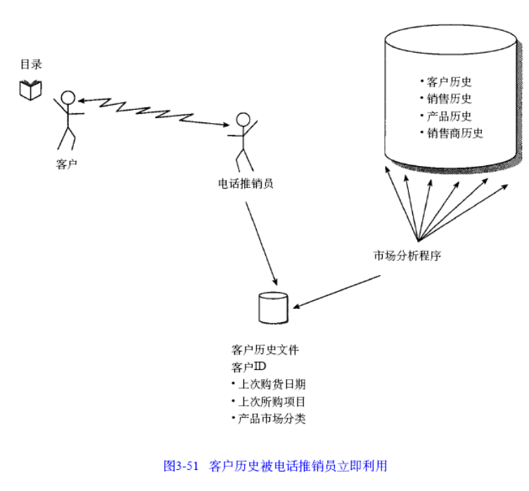

### 5.3.3. 客户关系管理
1. 由一个程序对数据仓库进行定期的分析，以检验相关的特征和标准。这种分析过程将在在线环境中产生一个小文件，其中包括了有关企业方面的简明信息。这样这个小文件就能够有效的被操作型环境所利用

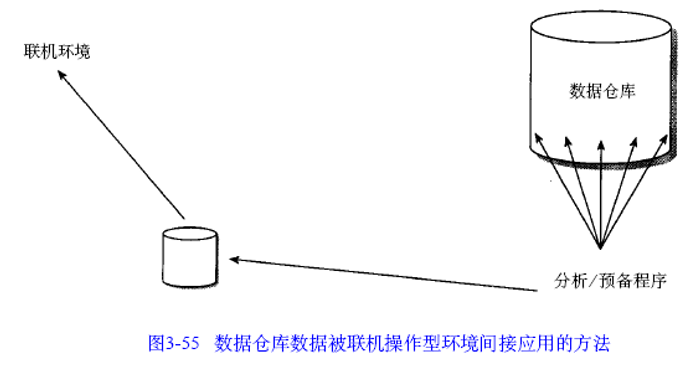

> 不是主流使用数据仓库的方式(是用自己的流程去获得帮助)，离线和在线相结合。

1. 分析程序：
   1. 拥有许多**人工智能**的特征：保证过程在直观和使用上是合理的。
   2. 可以运行在**任何可用**的数据仓库中
   3. 在后台运行，这样时间就不是一个大问题：必然是**离线**，数据环境无法对数据仓库直接访问
   4. 程序的运行与数据仓库发生变化的速度一致
2. 周期性刷新：
   1. 不是**经常**运行
   2. 以**离线模式**操作
   3. 支持从数据仓库到操作型环境的数据传输
3. **在线预分析数据文件**(可以是文件，也可以是操作性数据环境中的一张表)：
   1. 每个数据单元仅仅包含少量的数据，总体上可以包含大量的信息
   3. 准确地包含了在线处理人员所需要的东西：操作性业务环境的使用者
   4. 不被修改，但是以**批量方式周期性更新**
   5. 是在线高性能访问环境的一部分
   6. 访问效率高
   7. 适合访问单个数据单元，而不是大量数据

## 5.4. 分析型应用
1. 客户关系管理
2. 商业零售：进货出货
3. 金融领域：什么时候投保
4. 保险业：能否盈利
5. 电讯行业：不同消费行为能活力
6. 医疗保健：公共设施投入和医疗成本
7. 政府：红绿灯时限
8. 其他

### 5.4.1. 客户关系管理
1. 包括"客户数据的集成"和"客户信息的分析与挖掘"两个部分
2. 客户数据的集成
   1. 客户信息中的姓名和地址的集成
      1. 对姓名和地址进行解析，分成更细小的片断
      2. 对姓名和地址进行标准化
   2. 客户数据的更新
      1. 新客户的识别
      2. 老客户的信息更新(可能需要使用数据仓库中已有的历史数据)
3. 客户信息的分析与挖掘
   1. 客户特征分类分析:新客户的发现(客户和非客户对比)
   2. 客户盈利分析:优质客户挖掘
   3. 客户行为分析:客户异常行为的发现
   4. 客户需求分析:需求对应
   5. 客户反映分析
      1. 提供一对一服务(One to One)
      2. 防止已有客户的流失

### 5.4.2. 商业零售
1. 客户信息管理与分析，客户关系管理
   1. 客户特征分析
   2. 客户购买行为与购买习惯分析
2. 销售分析
   1. 销售额与销售时间的关系
   2. 销售额与商品的关系
   3. 销售额与销售地区的关系
   4. 销售额与购买客户的关系
3. 货种管理：不同种类商品之间的关系分析
4. 市场分析
   1. 商品销售预测
   2. 商品价格分析
   3. 零售点设置布局
5. 库存管理
   1. 仓库使用管理：仓库存放本身没有价值，提高流转率
   2. 商品的库存数量分析
6. 人力资源管理

### 5.4.3. 金融领域
1. 帐户信用等级的评估：使用聚类分析等方法对银行帐户进行分类，并得到帐户的信用等级
2. 信用卡运作
   1. 新客户的发现：哪些客户最有可能使用我们的信用卡，他们通常申请什么类型的信用卡？
   2. 优质客户挖掘：哪些客户是最有利可图的？
   3. 老客户的保留：怎样才能让他们更多的使用信用卡进行支付？
   4. 信用卡使用模式分析：欺诈的识别与防止
3. 股票交易规律分析
   1. 客户分类分析
   2. 客户交易分析
   3. 客户帐户分析
   4. 客户价值分析
4. 财政预算和计划

### 5.4.4. 保险业
1. 保险费率的确定：可以从大量客户投保数据中分析并取得不同条件、不同人员、不同险种、不同时间与年龄的保险费率，使保险业主能获得合理的利润
2. 险种关联分析：可以分析客户在购买了某种保险后是否同时还会购买另一种保险
3. 认购险种的预测：可以通过数据挖掘预测新险种的客户群以及新险种的前景

### 5.4.5. 电讯行业
1. 客户开发：开展新客户，防止丢失很有利的客户，查明哪些客户会离开？为什么？
2. 活动成本管理：需花多少钱来实现一个新线或建立一项新服务
3. 价格制定：分时段制订收费标准
4. 调用详细记录分析
   1. 了解每次通话记录的详细信息，包括通话类型、时长、通话位置等，以便于进行定价和容量规划。
   2. 异常电话检测(盗打，欠费等)
5. 电信市场：向客户提供混合销售、呼叫、等待、留言等新服务

### 5.4.6. 医疗保健
1. 成本分析
   1. 费用支出分析
   2. 如何能最有效地减少费用支出
2. 客户分类

### 5.4.7. 政府
1. 税务
   1. 个人所得税的偷税漏税现象分析
   2. 税收政策与计划的制订
2. 交通
   1. 航班/车次的时间/方向/客流量分析
   2. 价格分析
   3. 客户满意度分析
3. 水利：防洪、抗旱决策分析
4. 公安

### 5.4.8. 其他
1. 新闻出版业
   1. 如何准确地找到目标读者？
   2. 如何能让读者续订？
   3. 如何增加广告收入？
   4. 如何提高促销活动的效果？
2. 酒店管理
   1. 如何识别客户特征？
   2. 如何以价格赢得客户忠诚？
   3. 如何防止那些订而不住的现象出现？

