Lecture4-Design of Data Warehouse
---

<!-- TOC -->

- [1. 数据仓库设计的由来](#1-数据仓库设计的由来)
- [2. 操作型数据库 vs. 数据仓库](#2-操作型数据库-vs-数据仓库)
- [3. 数据仓库设计的原则](#3-数据仓库设计的原则)
  - [3.1. 设计原则 1 - 面向主题原则](#31-设计原则-1---面向主题原则)
  - [3.2. 设计原则 2 - 数据驱动原则](#32-设计原则-2---数据驱动原则)
  - [3.3. 设计原则 3 - 原型法设计原则](#33-设计原则-3---原型法设计原则)
- [4. 从操作型数据开始](#4-从操作型数据开始)
  - [4.1. 过程或数据模型与设计环境](#41-过程或数据模型与设计环境)
  - [4.2. 数据模型的性质](#42-数据模型的性质)
  - [4.3. 数据模型与迭代开发](#43-数据模型与迭代开发)
  - [4.4. 数据仓库设计的三级数据模型](#44-数据仓库设计的三级数据模型)
- [5. 数据仓库的设计步骤](#5-数据仓库的设计步骤)
  - [5.1. 系统规划](#51-系统规划)
    - [5.1.1. 系统规划 - 明确主题](#511-系统规划---明确主题)
    - [5.1.2. 系统规划 - 技术准备](#512-系统规划---技术准备)
    - [5.1.3. 数据仓库的设计/生成和运维](#513-数据仓库的设计生成和运维)
  - [5.2. 概念模型设计](#52-概念模型设计)
    - [5.2.1. 概念模型设计 - 确定系统边界](#521-概念模型设计---确定系统边界)
    - [5.2.2. 概念模型设计 - 确定主要的主题及其内容](#522-概念模型设计---确定主要的主题及其内容)
  - [5.3. 逻辑模型设计](#53-逻辑模型设计)
    - [5.3.1. 逻辑模型设计 - 粒度划分](#531-逻辑模型设计---粒度划分)
      - [5.3.1.1. 商品销售 –"时间"属性的粒度设计](#5311-商品销售-时间属性的粒度设计)
      - [5.3.1.2. 商品销售 –"商品"属性的粒度设计](#5312-商品销售-商品属性的粒度设计)
      - [5.3.1.3. 商品库存 –"时间"属性的粒度设计](#5313-商品库存-时间属性的粒度设计)
      - [5.3.1.4. 用于商场管理者的数据仓库](#5314-用于商场管理者的数据仓库)
    - [5.3.2. 逻辑模型设计 – 数据分割](#532-逻辑模型设计--数据分割)
    - [5.3.3. 逻辑模型设计 – 定义数据来源及其抽取规则](#533-逻辑模型设计--定义数据来源及其抽取规则)
  - [5.4. 物理模型设计](#54-物理模型设计)
    - [5.4.1. 物理模型设计 – 合并表](#541-物理模型设计--合并表)
    - [5.4.2. 物理模型设计 – 建立数据序列](#542-物理模型设计--建立数据序列)
    - [5.4.3. 物理模型设计 – 引入冗余](#543-物理模型设计--引入冗余)
    - [5.4.4. 物理模型设计 – 表的物理分割](#544-物理模型设计--表的物理分割)
    - [5.4.5. 物理模型设计 – 生成导出数据](#545-物理模型设计--生成导出数据)
    - [5.4.6. 物理模型设计 – 建立广义索引](#546-物理模型设计--建立广义索引)
  - [5.5. 数据仓库生成](#55-数据仓库生成)
  - [5.6. 数据仓库的使用与维护](#56-数据仓库的使用与维护)
  - [5.7. 数据仓库的生命周期](#57-数据仓库的生命周期)

<!-- /TOC -->

# 1. 数据仓库设计的由来
1. 在事务型数据处理中需要作数据库设计，而在分析型数据处理中则需作数据仓库设计，这两者在**原理上是一致**的
2. 因此，数据库设计中的很多设计思想与方法都可在数据仓库中得到应用，但是由于事务型与分析型的数据处理的不一致，两者在设计中的很多方面也存在着差别
3. 面向OLTP的数据库设计有着明确的**应用需求**，严格遵循系**统生命周期**的阶段划分，每个阶段都规定有明确的任务，上一阶段确定的任务完成后，产生一定格式的文档交给下一阶段
4. 创建数据仓库的重要有两部分
   1. **与操作型系统接口的设计(ETL)**
   2. **数据仓库本身的设计**
5. 数据仓库的需求只有在已装载部分数据并已开始使用时才能**完全确定清晰**，因此往往无法使用传统的需求驱动的方法进行

# 2. 操作型数据库 vs. 数据仓库
| 方面                 | 操作性数据库                                                                               | 数据仓库           |
| -------------------- | ------------------------------------------------------------------------------------------ | ------------------ |
| 面向的处理类型       | 面向应用                                                                                   | 面向分析           |
| 面向的需求           | 确定的应用需求                                                                             | 不确定的分析需求   |
| 系统设计目标         | 事务处理性能                                                                               | 全局一致的数据环境 |
| 数据来源或系统的输入 | 事务相关数据                                                                               | 多种多样           |
| 系统设计的方法和步骤 | <a href = "https://blog.csdn.net/chktsang/article/details/87007831">SDLC(系统生命周期)</a> | CLDS               |

1. SDLC(Software Development Lifecycle Model) 和 CLDS

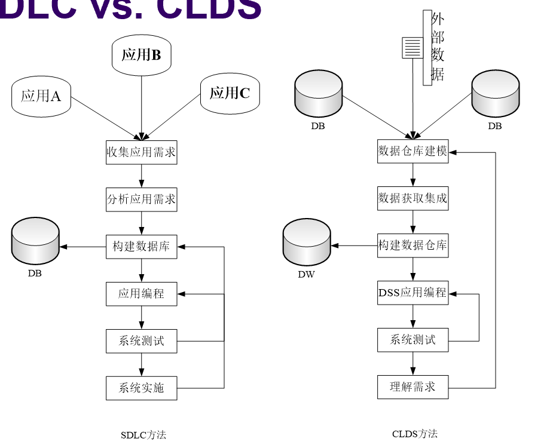

1. SDLC是在**最开始做需求分析**，CDLS可以在**理解需求的部分进行需求分析**。
2. 变化来源：数据仓库由于外部环境在变更则一定需要变更
   1. 客观变化：外部环境等客观变化
   2. 主观变化：每天的想法不一样
3. 上一个**分析人员**留下的部分不可能是很客观的

# 3. 数据仓库设计的原则
1. 数据仓库是**面向主题的、集成的、非易失、时变**的，这些特点决定了数据仓库的系统设计不能采用同开发传统的OLTP数据库一样的设计方法，其设计过程必须遵循下述三条原则：
   1. **面向主题原则**
   2. **数据驱动原则**
   3. **原型法设计原则**

## 3.1. 设计原则 1 - 面向主题原则
1. 构建数据仓库的目的是**面向企业的管理人员，为经营管理提供决策支持信息**。因此，数据仓库的组织设计必须以用户决策的需要来确定，即从用户决策的**主观需求**(主题)开始
2. 数据仓库中数据的**组织方法**
   1. 为了进行数据分析首先要有分析的主题，以**主题**为**起始点**，进行相关数据的设计，最终建立起一个**面向主题的分析型环境**
   2. 在数据库设计中则是以**客体**为起始点，即以**客观操作需求**为设计依据
3. 例如："商品销售"主题
   1. 建立目的：管理人员能够在适当的时候，订购适当的商品，并把它们分发到适当的商店中去销售，以提高商品的销售总金额
   2. 需要执行的分析操作：
      1. 分析什么样的商品，在什么样的时间和商店内畅销，即：分析商品的销售额与商品类型、销售时间及商店位置之间的变化关系
      2. 管理人员将据此决定他们的经营策略

## 3.2. 设计原则 2 - 数据驱动原则
1. 数据的来源
   1. 数据仓库是在现存**数据库系统基础**上进行开发的，它着眼于有效地**提取、综合、集成和挖掘**已有数据库中的**数据资源**，服务于企业**高层**领导管理决策分析的需要
   2. 因此，数据仓库中的数据必须是从**已有的数据源中抽取**而来，是已经存在的数据或对已经存在的数据**进行加工处理**而获得
2. 在数据仓库设计中，由于其所有数据均应建立在**已有的数据库基础**上，即是从已经存在于操作型环境中的数据出发进行数据仓库的设计，这种设计方法被称为 "数据驱动" 方法
   1. 从已有的数据库系统出发
   2. 按照分析领域对数据及数据间的**联系**重新考察
   3. 利用数据模型**有效识别**原有数据库中的数据**和**数据仓库中主题的数据的"共同性"

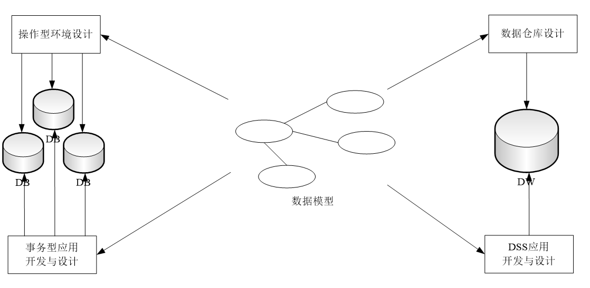

1. 数据仓库不能凭空产生
2. 首先构造操作型数据环境，然后构造分析型数据环境
3. 实际情况下使用这样的数据驱动模型是比较困难的
4. 考虑是否要先创建数据模型

## 3.3. 设计原则 3 - 原型法设计原则
1. **不断变化**的分析需求
   1. 数据仓库系统的**原始需求不明确**，且不断变化与增加，开发者最初并不能确切了解到用户的明确而详细的需求，用户所能提供的无非是需求的**大方向或部分需求**，更不能较准确地预见到以后的需求
   2. 因此，采用**原型法**来进行数据仓库的开发是比较合适的，即从构建系统的基本框架着手，不断丰富与完善整个系统
2. 逐步求精的设计过程
   1. 数据仓库用户的需求是在设计过程中**不断细化明确**的。同时，数据仓库系统的开发也是一个**经过不断循环、反馈而使系统不断增长与完善**的过程
   2. 在数据仓库开发的整个过程中，自始至终要求**决策人员和开发者**的共同参与和密切合作，**不做或尽量少做无效工作与重复工作**
3. 启发方式
   1. **一个迭代**的开发依赖于在**上一个迭代**所获得的结果
   2. **首先载入一部分数据供DSS分析员使用和查看**
   3. 然后根据最终用户的反馈，**修改数据或添加其他数据**。这种反馈过程贯穿于数据仓库的整个开发生命周期之中
4. **需求预测**仍然是十分重要的。**实际情况通常介于启发和预测两者之间**。

# 4. 从操作型数据开始
1. 将数据从操作型环境移入到数据仓库环境不是简单的抽取


2. 通常现有的操作型系统中的数据**缺乏集成**，建立现有的操作型应用时，根本**没有考虑**过以后可能存在的**集成问题**。每一个应用都拥有自己特殊的需求，可能会出现下列情况：
   1. **不同名同物**：一些相同的数据以不同的名字出现在各个地方
   2. **同名不同物**：一些不同的数据在不同的地方以相同的方式标注
   3. **数据不完整**：这里的数据不在其他地方出现
   4. **度量单位不同**：一些数据用相同的名字存在不同的地方，却使用不同的度量单位

| 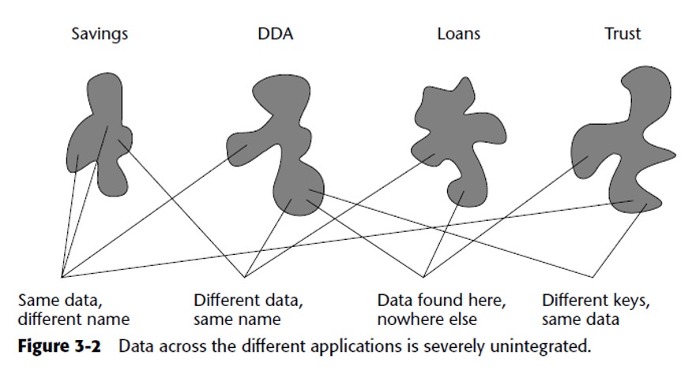 | 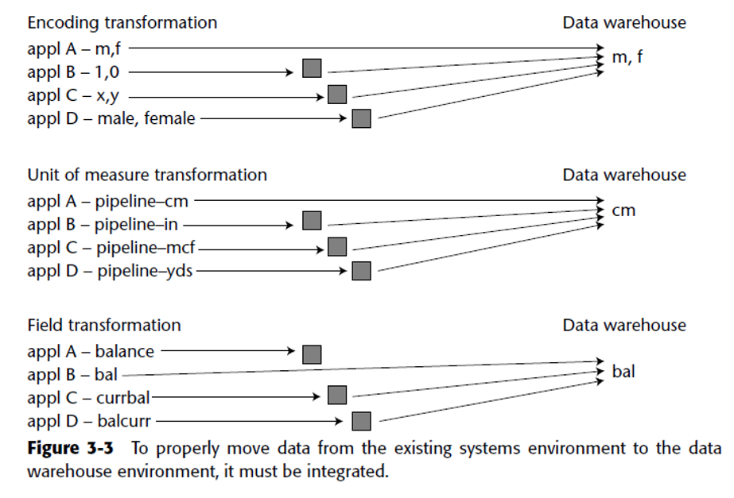 |
| ------------------- | ------------------- |

3. 从操作型环境到数据仓库有三种装载工作要做：
   1. 装载**档案数据**
   2. 装载在**操作型系统**中目前已有的数据
   3. 将自数据库上次刷新以来在操作型环境中**不断发生的变化**(更新)从操作型环境中装载到数据仓库中，可以通过以下多种方式来实现：
      1. 时间戳
      2. DELTA文件
      3. 建立映象文件
      4. 日志文件
4. 需要考虑存取操作型数据的效率

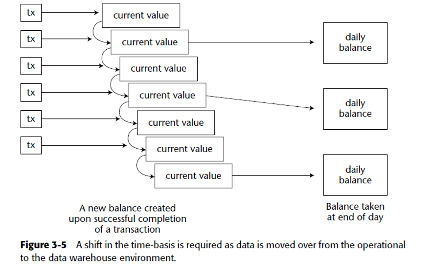

5. 数据量的管理
   1. 数据集成
   2. 多粒度
   3. 数据转储
6. 如果没有仔细管理和压缩数据量，那么在数据仓库中聚集的庞大数据量将无法实现仓库的目标。

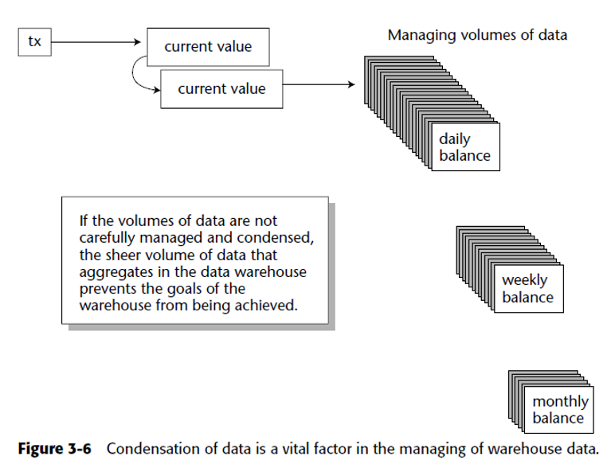

## 4.1. 过程或数据模型与设计环境
1. 过程模型(仅仅适合于操作型环境)
   1. 功能分解
   2. 第0层上下文图表
   3. 数据流图
   4. 结构图表
   5. 状态转换图
   6. HIPO 图
   7. 伪代码
2. 数据模型(既适合操作型环境，也适合于分析型环境)

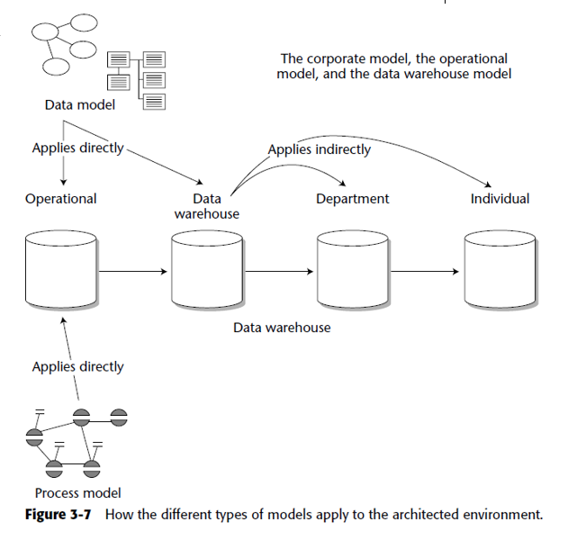

## 4.2. 数据模型的性质
1. **稳定性分析**，根据各个数据属性的变化特性将这些属性分组，稳定性和客观世界有关的，比如姓名这个数据的特性决定了其是相对稳定的。
   1. 很少更改：姓名等等
   2. 不时更改：年份等等
   3. 经常更改：库存量等等
2. 根据**稳定程度**讨论**逻辑优化、物理优化及ETL设计**等
3. 变化的频率需要通过**人工**等方式来确定，在优化的过程中是完全按照**可变性**进行修改的。


## 4.3. 数据模型与迭代开发
1. 迭代开发的重要性
   1. 业界成功的记录强烈地建议这样做
   2. 用户在第一遍迭代开发完成**以前不能清晰的提出需求**
   3. 只有**实际结果切实而且明确**时，管理部门才会作出**充分的承诺**。因此，必须能很快地见到**可见结果**
2. 数据模型在**每一遍开发**中都起着**路标**的作用，在开发结束时，所有遍次的开发结果融合在一起
   1. 当不同遍次的开发是基于不同的数据模型或没有数据模型时，会产生众多的重复工作，且**缺乏一致性**
   2. 在**某一个时刻**必须是**确定**的，并且需要明晰远景和当前的数据模型的关系。
   3. 最后一定能拼接出一个**方形**，不多不少不重(如图3-24所示)
   4. 重叠可能是**某两个开发团队对于某一部分做了两次，难以保证一致性问题**
   5. 之前的版本则是只有**边界是重复**的(如图3-25所示)
   6. 数据模型应该是一个**蓝本**


## 4.4. 数据仓库设计的三级数据模型
1. 概念模型
   1. 为一定目标设计系统、收集信息而服务的**概念型工具**，是客观世界到机器世界的一个中间层次，在这之前是将需求部分转化为概念模型。
   2. E-R法
2. 逻辑模型
   1. 描述了数据仓库的主题的**逻辑实现**
   2. 关系模型
3. 物理模型
   1. 逻辑模型在数据仓库中的**实现**
   2. 逻辑模型转换到物理模型不在本课程讨论范围，同样的，从物理模型到逻辑模型也是。

> 基本上是对应的，但是相对比较少

1. 高级模型
   1. 对数据的抽象程度最大
   2. E-R图
2. 中级模型
   1. 数据项(dis-data item set)
   2. dis是E-R图的细分，大体上E-R图中的每个实体对应一个dis
3. 低级模型:物理数据模型

# 5. 数据仓库的设计步骤
> 数据仓库设计大致有如下几个步骤：

1. 系统规划
   1. 明确主题
   2. 技术准备
2. 概念设计
3. 逻辑设计
4. 物理设计
5. 数据仓库生成
6. 数据仓库的运行与维护

## 5.1. 系统规划

### 5.1.1. 系统规划 - 明确主题
1. 在数据仓库设计的开始，首先要做的事是有关分析人员需要**确定具体领域的分析对象**，这个**对象就是主题**。
2. 主题是一种**较高层次的抽象**，对它的认识与表示是一个**逐步完善**的过程。因此，在开始时不妨先确定一个初步的主题概念以利于**设计工作的开始**，此后随着设计工作的进一步开展，再**逐步扩充与完善(原型设计法)**

### 5.1.2. 系统规划 - 技术准备
1. 准备具体的**技术要求和物理实现环境**，包括：
   1. 技术评估，其内容包括数据仓库的**性能指标**，如：
      1. **数据存取**能力(包括管理海量数据的能力)
      2. **模型重组**能力
      3. **数据装载**能力
   2. 技术环境准备：在评估基础上提出数据仓库的**软硬件平台要求**，包括计算机、网络结构、操作系统、数据库及数据仓库软件的选购要求等

### 5.1.3. 数据仓库的设计/生成和运维
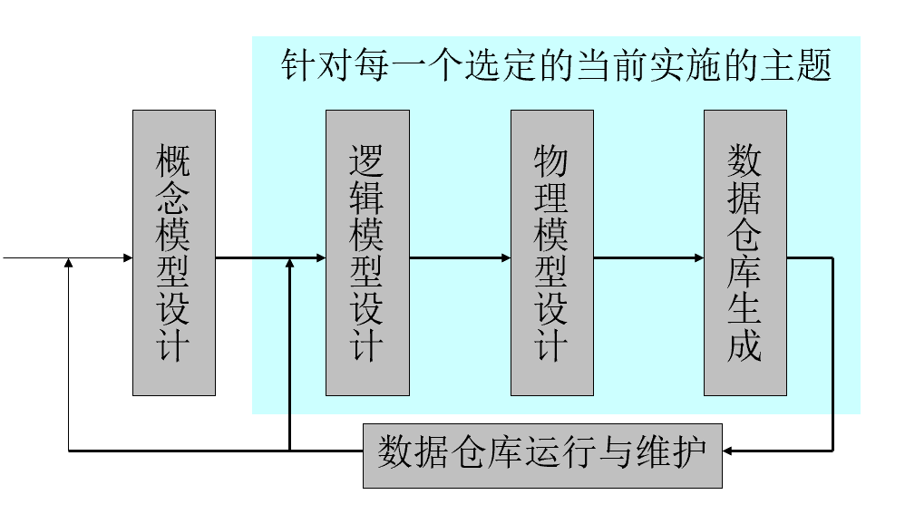

> 概念模型设计：星型模型或雪花模型

## 5.2. 概念模型设计
1. 确定**系统边界**
2. 确定**主要的主题及其内容**
3. OLAP等分析应用的设计：在**后续分析和二次分析**的过程中是非常重要的

### 5.2.1. 概念模型设计 - 确定系统边界
1. 要做的决策类型有哪些？
2. 决策者感兴趣的是什么问题？
3. 这些问题需要什么样的信息？
4. 要得到这些信息需要包含哪些数据源？

### 5.2.2. 概念模型设计 - 确定主要的主题及其内容
1. 确定主要的主题
   1. 明确数据仓库的**分析对象**，然后对每个主题的内容**进行较详细的描述**，包括：
      1. 确定**主题及其属性信息**
      2. 描述**每个属性的取值情况**：变化情况
         1. 固定不变的
         2. 半固定的
         3. 经常变化的
      3. 确定主题的**公共码键**
      4. 主题之间的关系：主题间**联系及其属性**
2. 在确定上述内容后，就可以用传统的**实体联系模型**(E-R模型)来表示数据仓库的概念数据模型
3. 商品、顾客和供应商之间的E-R图


## 5.3. 逻辑模型设计
1. 将**E-R图**转换成关系数据库的**二维表**
2. 定义**数据源和数据抽取**规则
3. 在逻辑模型的设计过程中，需要考虑以下一些问题：
   1. 适当的**粒度划分**
   2. 合理的**数据分割**策略
   3. 定义合适的**数据来源**

### 5.3.1. 逻辑模型设计 - 粒度划分
1. 在设计过程中需要考虑数据仓库中**数据粒度的划分**原则，即**数据单元的详细程度和级别**
   1. 数据越详细，粒度越小，级别就越低
   2. 数据综合度越高，粒度越大，级别就越高
2. 一般将数据划分为：**详细数据、轻度总结、高度总结**三种粒度，或者采用更多级的粒度划分方法。例如：
   1. 根据**时间跨度**进行的统计有：天，周，月，季度，年
   2. 对于不适合进行统计的属性值，可以**采样获取数据**
3. 粒度的划分将直接影响到数据仓库中的**数据量**以及所适合的**查询类型**，**粒度划分是否适当**是影响数据仓库性能的一个重要方面

#### 5.3.1.1. 商品销售 –"时间"属性的粒度设计
1. 商品固有信息：`商品表(商品号，商品名，类型，颜色，...) /* 细节数据 */`
2. 商品销售信息：`(细节数据、天、周、月、季度、年)`

```
/* 细节数据 */
销售表(商品号，顾客号，销售日期，售价，销售量，...)
/* 以"天"为时间统计单位的综合数据 */
销售表d1(时间属性_日 ，商品属性，... ，销售总量)
/* 以"周"为时间统计单位的综合数据 */
销售表d2(时间属性_周 ，商品属性， ... ，销售总量)
/* 以"月"为时间统计单位的综合数据 */
销售表d3(时间属性_月 ，商品属性， ... ，销售总量)
/* 以"季度"为时间统计单位的综合数据 */
销售表d4(时间属性_季度，商品属性， ... ，销售总量)
/* 以"年"为时间统计单位的综合数据 */
销售表d5(时间属性_年，商品属性， ... ，销售总量)
```

#### 5.3.1.2. 商品销售 –"商品"属性的粒度设计
1. 商品销售信息：商品属性角度的粒度设计补充，细节、商品、小类、大类

```
/* 细节数据 */
销售表(商品号，顾客号，销售日期，售价，销售量，...)
/* 以具体"商品"为商品属性的统计单位的综合数据 */
销售表p1(时间属性_X ，商品属性_商品号，... ，销售总量)
/* 以"小类"为商品属性的统计单位的综合数据 */
销售表p2(时间属性_X ，商品属性_小类 ， ... ，销售总量)
/* 以"大类"为商品属性的统计单位的综合数据 */
销售表p3(时间属性_X ，商品属性_大类 ， ... ，销售总量)
```

2. 将时间、商品等属性综合起来考虑，上述的统计表有很多。

#### 5.3.1.3. 商品库存 –"时间"属性的粒度设计
1. 商品库存信息：

```
/* 细节数据 */
库存表(商品号，库房号，库存量，日期，...)
/* 样本数据 */
库存表1(商品号，库房号，库存量，取样时间_周，...)
库存表2(商品号，库房号，库存量，取样时间_月，...)
库存表3(商品号，库房号，库存量，取样时间_季度，...)
库存表4(商品号，库房号，库存量，取样时间_年，...)
```

2. 数据综合的方式与前面的商品销售主题不同

#### 5.3.1.4. 用于商场管理者的数据仓库
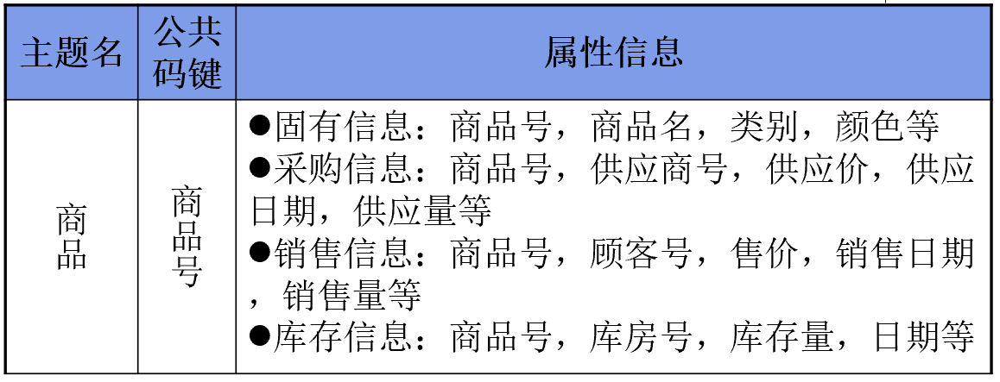
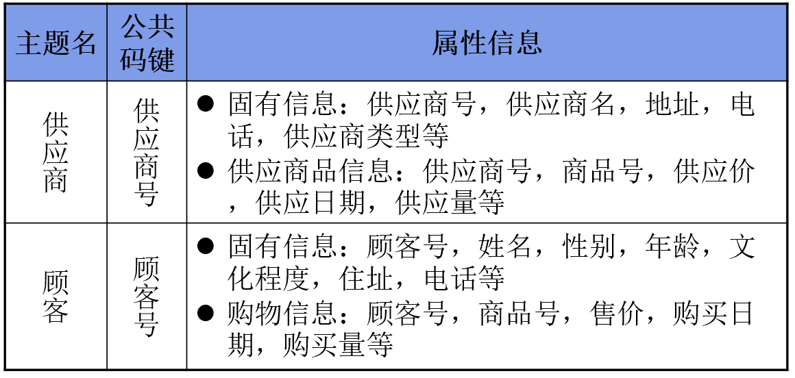

### 5.3.2. 逻辑模型设计 – 数据分割
1. 数据的分割是指把**逻辑上是统一整体的数据**分割成**较小的、可以独立管理的数据单元**进行存储(关系)，以便于**重构、重组和恢复**，以**提高创建索引和顺序扫描**的效率
2. 选择数据分割的因素有：
   1. **数据量的大小**
   2. **数据分析处理的对象**(主题)
   3. **简单易行的数据分割标准**
   4. **数据粒度的划分策略**
3. 通常采用"时间"属性作为数据分割的依据
4. 数据分割技术类似于数据库中的**数据分片技术**，其目的是**为了提高数据仓库的性能**

### 5.3.3. 逻辑模型设计 – 定义数据来源及其抽取规则
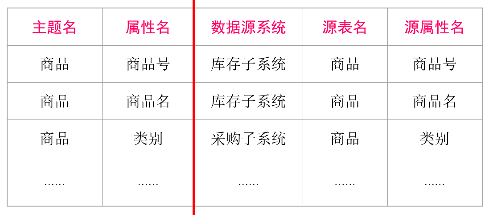

## 5.4. 物理模型设计
1. 在逻辑模型设计基础上确定数据的**存储结构**、确定**索引策略**、确定**存储分配及数据存放位置等与物理有关的内容**，物理模型设计的具体方法与数据库设计中的大致相似。其目的是为了**提高数据仓库系统的访问性能**
2. 在任务上，数据仓库和数据库没有太大差异。
3. 常用的一些技术有：
   1. 合并表
   2. 建立数据序列
   3. 引入冗余
   4. 表的物理分割
   5. 生成导出数据
   6. 建立广义索引
4. 规范化/反规范化

### 5.4.1. 物理模型设计 – 合并表
1. 在常见的一些分析处理操作中，可能需要执行**多表连接**操作。为了节省I/O开销，**可以把这些表中的记录混合存放在一起**，以**减低表的连接操作的代价**
2. 合并表技术与传统关系数据库中的**集簇**(Clustering)技术类似，如下图所示

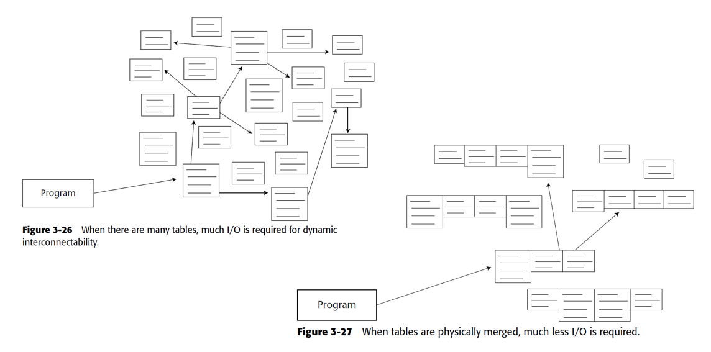

1. 代码具有一定的**随意性**
2. 数据库只能在左上部分和右下部分只能选择一个，否则会导致**冗余性**
3. 但是数据仓库中，在持有左上数据的基础上，也可以持有右下的数据
4. 右下的数据也可以放置在**数据集市**(狭义数据仓库)中。

### 5.4.2. 物理模型设计 – 建立数据序列
1. 考虑创建一个数据序列，这样如果数据存放在一行中，那么**一次I/O就足以检索到了**
2. 通常当**数列中值的数量稳定**、**数据是按顺序访问的**、**数据的创建与修改在统计上是以非常有规律的方式**进行等条件都满足时，创建一个数据序列才是有意义的

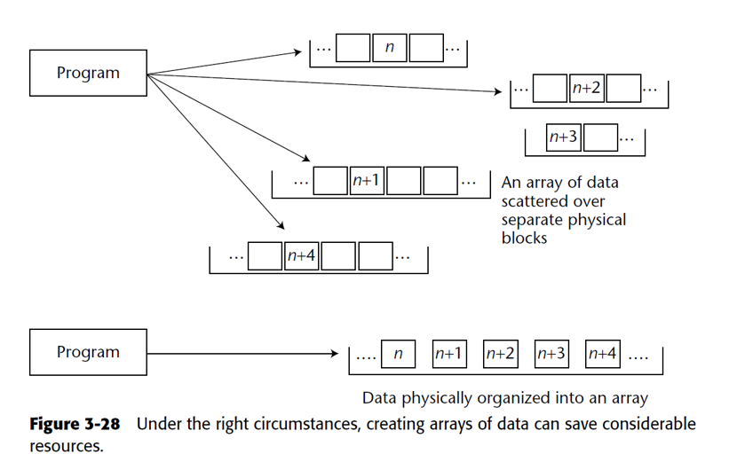

1. 如果目前的存储系统是顺序式的和非顺序式的是有区别的。

### 5.4.3. 物理模型设计 – 引入冗余
1. 在面向某个主题的分析过程中，通常需要访问不同表中的**多个属性**，而每个属性又可能参与多个不同主题的分析过程。因此可以通过修改关系模式把某些属性复制到**多个不同的主题表**中去，从而减少**一次分析过程需要访问的表的数量**
2. 采用该种**数据组织**方法会带来大量的**数据冗余存储**，数据仓库系统必须保证这些冗余数据的**一致性**。由于数据仓库中的数据是稳定的，很少执行更新操作，不会因此带来过高的数据更新的代价，但可以**有效地提高数据仓库系统的性能**，数据稳定性这一点上就是和数据仓库系统有着本质区别。

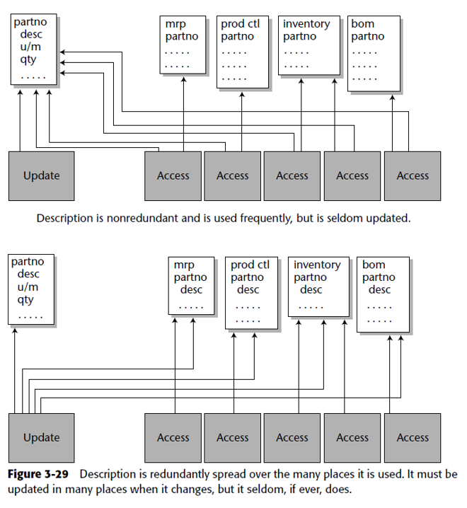

1. 其他表通过外关键字partno和原来的表进行关联。
2. 每一条连接线都是**跨表**的描述访问，由于跨表访问，导致了部分关键字是冗余存储的。
3. 一般的数据库不会有过多冗余，因为无法保证备份是一致的：因为不是所有的冗余表对用户应用都是**透明**的
4. 就算执行了**冗余存储**，和数据库本身也没有关系。
5. 然而在数据仓库中没有这个问题，因为数据仓库是通过**ETL进行同步更新**的。

### 5.4.4. 物理模型设计 – 表的物理分割
1. 类似于在逻辑设计阶段的**数据分割**
2. 可以根据表中每个属性数据的访问频率和稳定性程度对表的存储结构进行分割
   1. 对于**访问频率较高**的属性，可以单独考虑其物理存储组织，以便选择合适的索引策略和特定的物理组织方式
   2. 对于**需要频繁更新**的属性，也可以单独组织其物理存储，以免因数据更新而带来的空间重组、重构等工作
  


3. 分拆方式
   1. 横拆：将**元组**拆出来
   2. 纵拆：将**属性**拆出来
4. ETL不是对所有的数据都进行检查有无修改，比如姓名就不必经常查看修改。
5. 表的物理分割各种关于更新的属性是比较重要的

### 5.4.5. 物理模型设计 – 生成导出数据
1. 在**原始、细节数据**的基础上进行一些**统计和计算**，生成**导出数据**，并保存在数据仓库中
2. 优点
   1. 避免在分析过程中执行过多的统计或计算操作，减少输入/出的次数，**提高分析操作的性能**
   2. 避免了不同用户进行重复统计操作可能产生的**偏差**

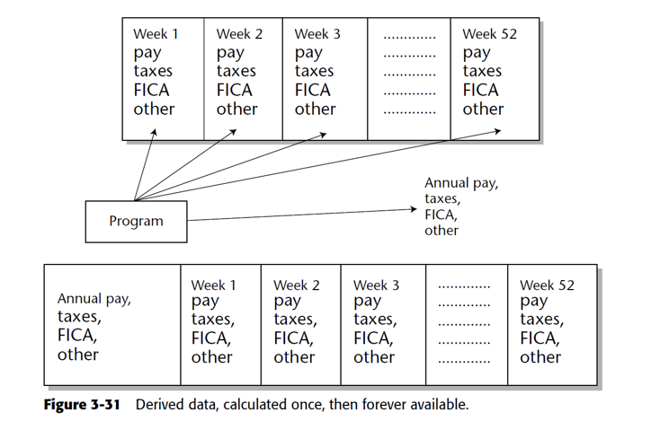

### 5.4.6. 物理模型设计 – 建立广义索引
1. 用于记录数据仓库中数据与 "最" 有关的统计结果的索引被称为 "**广义索引**"。如：
   1. 当月销售额最高的商店？
   2. 当月销售情况最差的商品？
2. 这样的**广义索引的数据量是非常小**的，可以在每次进行数据仓库数据加载工作时**生成或刷新这样的广义索引**。用户可以从已经建立的广义索引里直接获取这些统计信息，而**不必对整个数据仓库进行扫描**

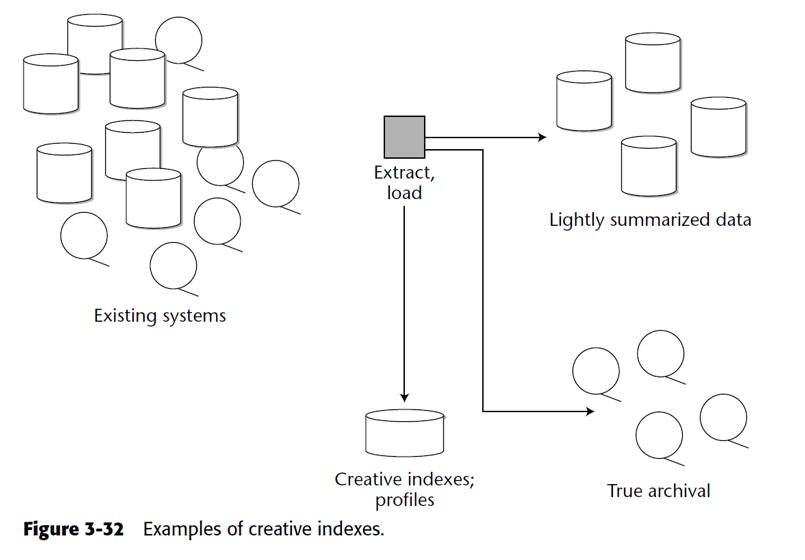

1. 广义索引能不能运行在数据库上？不能，因为广义索引会影响到操作性数据环境的效率
2. 使用冗余仓库，来避免对数据仓库的**大量刷新查询操作**的发生。

## 5.5. 数据仓库生成
1. **建立数据模式**：根据**逻辑设计与物理设计**的设计结果建立数据仓库的数据模式
2. 编制**数据抽取**程序：根据数据仓库**元数据中的定义信息**，编制抽取程序，将数据源中的数据作加工以形成**数据仓库中的数据**
3. **数据加载**：将数据源中的数据，通过数据抽取程序加载到**数据仓库的数据模式**中去

## 5.6. 数据仓库的使用与维护
1. 在数据仓库建立后，就可以建立**分析、决策型**的应用系统
2. 在应用系统的使用过程中不断加深理解，改进主题，依照**原型法**的思想使系统更趋完善
3. 在系统的运行过程中，随着数据源中数据的不断变化，需要通过数据刷新操作来维护数据仓库中数据的一致性

## 5.7. 数据仓库的生命周期
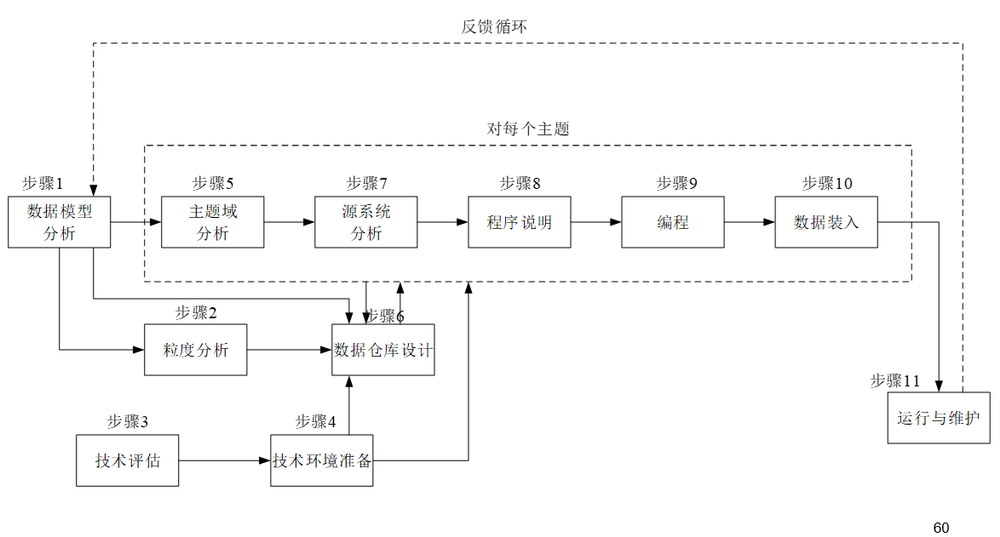
